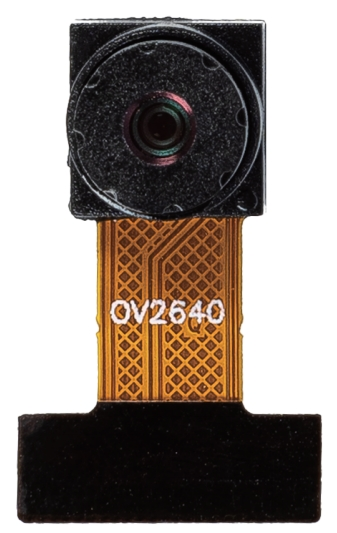

 .. note::

    Hello, welcome to the SunFounder Raspberry Pi & Arduino & ESP32 Enthusiasts Community on Facebook! Dive deeper into Raspberry Pi, Arduino, and ESP32 with fellow enthusiasts.

    **Why Join?**

    - **Expert Support**: Solve post-sale issues and technical challenges with help from our community and team.
    - **Learn & Share**: Exchange tips and tutorials to enhance your skills.
    - **Exclusive Previews**: Get early access to new product announcements and sneak peeks.
    - **Special Discounts**: Enjoy exclusive discounts on our newest products.
    - **Festive Promotions and Giveaways**: Take part in giveaways and holiday promotions.

    👉 Ready to explore and create with us? Click [|link_sf_facebook|] and join today!

Camera
============

The OV2640 camera module is compact, measuring just 21mm in length. It is equipped with a 1/4-inch lens and an aperture of f/2.4, offering a broad field of view of 68 degrees. This module delivers high-resolution images with a pixel count of 2 million and a maximum resolution of 1600x1200. It utilizes the DVP interface, making it versatile for a variety of applications.

**Specifications**

* **Model**: OV2640
* **Length**: 21mm
* **Pixels**: 2 Million
* **Field of View**: 68°
* **Interface**: DVP
* **Lens Size**: 1/4
* **Resolution**: 1600x1200
* **Aperture**: f/2.4

