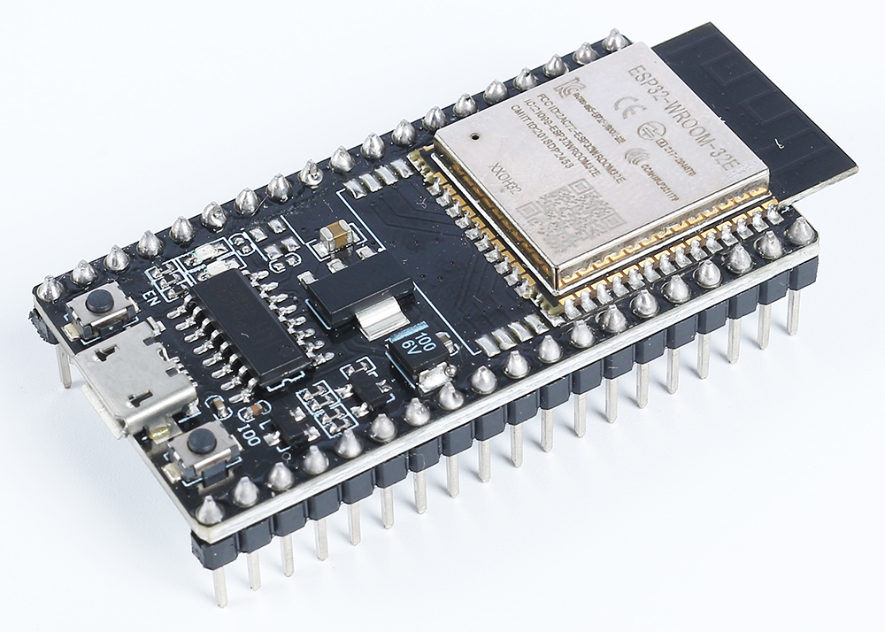
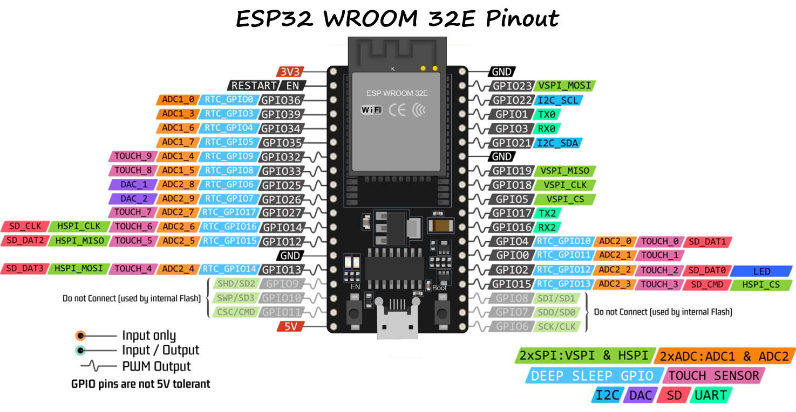

.. note::

    こんにちは！ SunFounder Raspberry Pi & Arduino & ESP32 Enthusiasts Community on Facebookへようこそ！ 一緒にRaspberry Pi、Arduino、ESP32の世界を深く探求しましょう。

    **参加する理由**

    - **専門家サポート**：コミュニティやチームの助けを借りて、販売後の問題や技術的な課題を解決できます。
    - **学びと共有**：スキルを向上させるためのヒントやチュートリアルを交換できます。
    - **独占プレビュー**：新製品の発表や先行情報に早期アクセスできます。
    - **特別割引**：最新の製品に対する特別割引をお楽しみください。
    - **フェスティバルプロモーションとプレゼント**：プレゼントやホリデープロモーションに参加できます。

    👉 私たちと一緒に探求し、創造する準備ができましたか？ [|link_sf_facebook|] をクリックして今日参加しましょう！

.. _cpn_esp32_wroom_32e:

ESP32 WROOM 32E
=====================

ESP32 WROOM-32Eは、EspressifのESP32チップセットを中心に設計された多用途で強力なモジュールです。デュアルコアプロセッサ、統合されたWi-FiおよびBluetooth接続機能、多くの周辺インターフェースを提供します。低消費電力で知られるこのモジュールは、コンパクトなフォームファクターでスマートな接続と堅牢な性能を実現するIoTアプリケーションに最適です。

主な特長は次の通りです：

* **処理能力**：デュアルコアのXtensa® 32ビットLX6マイクロプロセッサを搭載し、スケーラビリティと柔軟性を提供します。
* **無線機能**：統合された2.4 GHz Wi-FiとデュアルモードBluetoothを備え、安定した無線通信を必要とするアプリケーションに最適です。
* **メモリとストレージ**：十分なSRAMと高性能のフラッシュストレージを備え、ユーザープログラムとデータストレージのニーズに応えます。
* **GPIO**：最大38のGPIOピンを提供し、さまざまな外部デバイスやセンサーをサポートします。
* **低消費電力**：複数の省電力モードが利用可能で、バッテリ駆動やエネルギー効率の高いシナリオに最適です。
* **セキュリティ**：統合された暗号化およびセキュリティ機能により、ユーザーデータとプライバシーをしっかり保護します。
* **多用途性**：家庭用電化製品から高度な産業機械まで、WROOM-32Eは一貫した効率的な性能を提供します。

まとめると、ESP32 WROOM-32Eは堅牢な処理能力と多様な接続オプションを提供するだけでなく、IoTおよびスマートデバイス分野での利用に適した多くの機能を備えています。

* |link_esp32_datasheet|

.. _esp32_pinout:

ピン配置図
-------------------------

ESP32には、さまざまな機能が特定のピンを共有しているため、ピンの使用にいくつかの制限があります。プロジェクトを設計する際には、ピンの使用を慎重に計画し、潜在的な競合を確認して、適切な動作を確保し、問題を回避することが重要です。

以下は主な制限と考慮事項です：

* **ADC1およびADC2**：ADC2はWiFiまたはBluetoothがアクティブな場合には使用できません。ただし、ADC1は制限なく使用できます。
* **ブートストラップピン**：GPIO0、GPIO2、GPIO5、GPIO12、およびGPIO15はブートプロセス中に使用されます。これらのピンに外部コンポーネントを接続する際には、ブートプロセスに干渉しないように注意が必要です。
* **JTAGピン**：GPIO12、GPIO13、GPIO14、およびGPIO15は、デバッグ目的でJTAGピンとして使用できます。JTAGデバッグが不要な場合、これらのピンは通常のGPIOとして使用できます。
* **タッチピン**：一部のピンはタッチ機能をサポートしています。タッチセンシングで使用する場合には、これらのピンを慎重に使用する必要があります。
* **電源ピン**：一部のピンは電源関連の機能に予約されています。たとえば、3V3やGNDのような電源供給ピンから過剰な電流を引き出さないようにしてください。
* **入力専用ピン**：一部のピンは入力専用であり、出力として使用しないでください。

.. _esp32_strapping:

**ストラップピン**
--------------------------

ESP32には5つのストラップピンがあります：

.. list-table::
    :widths: 5 15
    :header-rows: 1

    *   - ストラップピン
        - 説明
    *   - IO5
        - プルアップがデフォルトで、IO5およびIO15の電圧レベルはSDIOスレーブのタイミングに影響します。
    *   - IO0
        - プルアップがデフォルトで、ローにプルされるとダウンロードモードに入ります。
    *   - IO2
        - プルダウンがデフォルトで、IO0およびIO2がローにプルされるとダウンロードモードに入ります。
    *   - IO12(MTDI)
        - プルダウンがデフォルトで、ハイにプルされるとESP32は通常起動できません。
    *   - IO15(MTDO)
        - プルアップがデフォルトで、ローにプルされるとデバッグログが表示されません。さらに、

ソフトウェアは、レジスタ "GPIO_STRAPPING" からこれらの5つのビットの値を読み取ることができます。
チップのシステムリセット解除（電源オンリセット、RTCウォッチドッグリセット、およびブラウンアウトリセット）
時に、ストラップピンのラッチが電圧レベルをストラップビット "0" または "1" としてサンプリングし、チップの
電源が切れるまでまたはシャットダウンするまでこれらのビットを保持します。ストラップビットは、デバイスのブー
トモード、VDD_SDIOの動作電圧、およびその他の初期システム設定を構成します。

各ストラップピンは、チップのリセット中に内部プルアップ/プルダウンに接続されています。そのため、
ストラップピンが未接続の場合、または接続されている外部回路が高インピーダンスの場合、内部の弱い
プルアップ/プルダウンがストラップピンのデフォルト入力レベルを決定します。

ストラップビットの値を変更するには、外部のプルダウン/プルアップ抵抗を適用するか、ホストMCUのGPIO
を使用してESP32の電源オン時にこれらのピンの電圧レベルを制御できます。

リセット解除後、ストラップピンは通常の機能ピンとして動作します。
以下の表に、ストラップピンによる詳細なブートモード設定を示します。

.. image:: img/esp32_strapping.png

* FE：フォーリングエッジ、RE：ライジングエッジ
* ファームウェアは、ブート後に「内部LDOの電圧（VDD_SDIO）」および「SDIOスレーブのタイミング」の設定を変更するためにレジスタビットを構成できます。
* モジュールは3.3V SPIフラッシュを統合しているため、モジュールの電源が入っているときにピンMTDIを1に設定できません。
