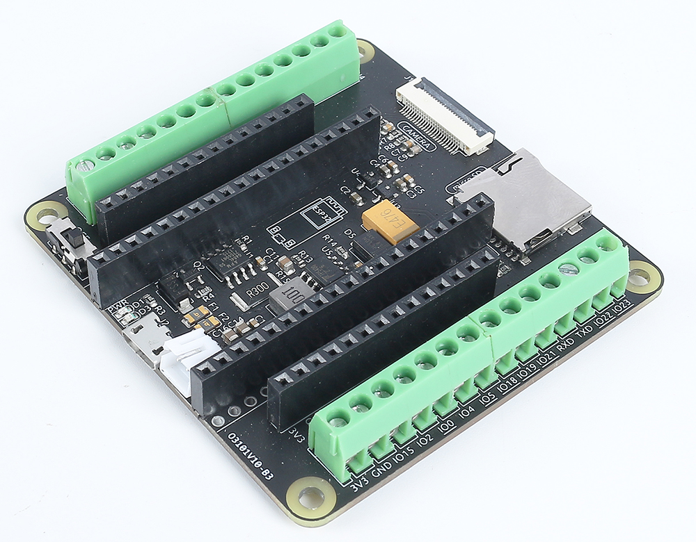
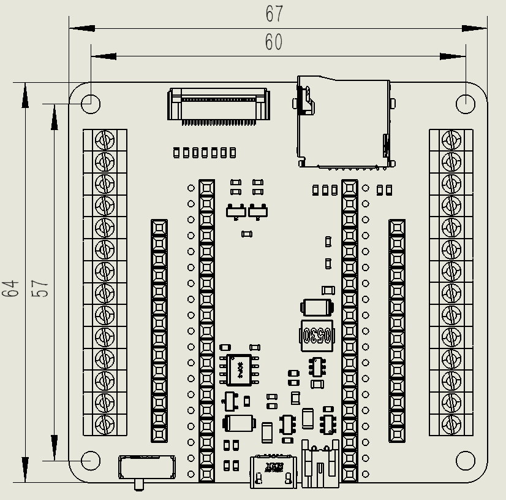
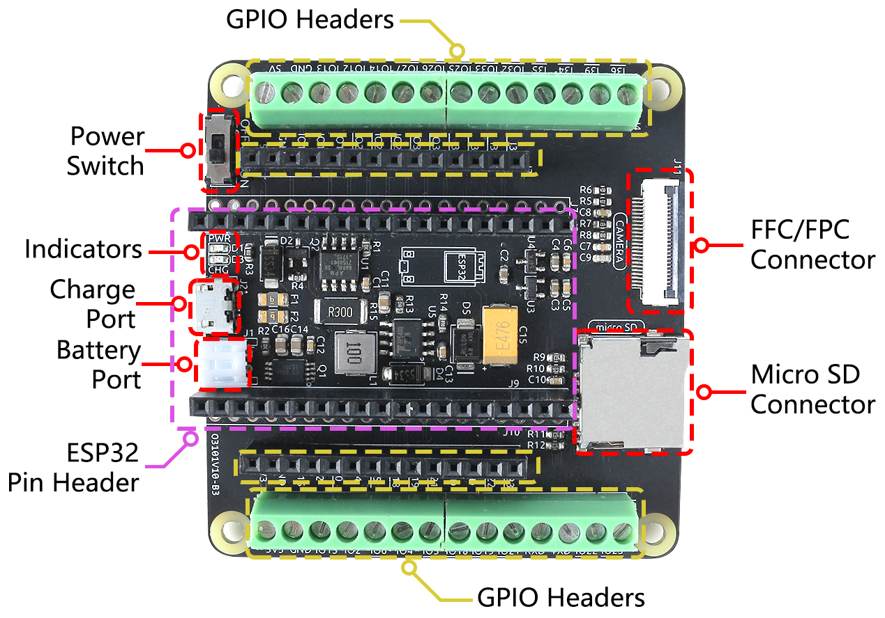

 .. note::

    Hello, welcome to the SunFounder Raspberry Pi & Arduino & ESP32 Enthusiasts Community on Facebook! Dive deeper into Raspberry Pi, Arduino, and ESP32 with fellow enthusiasts.

    **Why Join?**

    - **Expert Support**: Solve post-sale issues and technical challenges with help from our community and team.
    - **Learn & Share**: Exchange tips and tutorials to enhance your skills.
    - **Exclusive Previews**: Get early access to new product announcements and sneak peeks.
    - **Special Discounts**: Enjoy exclusive discounts on our newest products.
    - **Festive Promotions and Giveaways**: Take part in giveaways and holiday promotions.

    👉 Ready to explore and create with us? Click [|link_sf_facebook|] and join today!

.. _cpn_esp32_camera_extension:

ESP32 Camera Extension
=======================

We have designed an expansion board that enables you to fully utilize the camera and SD card functionalities of the ESP32 WROOM 32E. By combining the OV2640 camera, Micro SD, and ESP32 WROOM 32E, you get an all-in-one expansion board.

The board provides two types of GPIO headers - one with female headers, perfect for quick prototyping projects. The other type features screw terminals, ensuring stable wire connections and making it suitable for IoT projects.

Additionally, you can power your project using a single 3.7V 18650 battery. If the battery runs low, you can conveniently charge it by simply plugging in a 5V Micro USB cable. This makes it a great tool for outdoor projects and remote applications.

Specification Table
------------------------

.. list-table::
    :widths: 30 10 10 10 10
    :header-rows: 1

    *   - Parameter
        - Minimum Value
        - Typical Value
        - Maximum Value
        - Unit
    *   - Battery Shutdown Current
        - \-
        - \-
        - 60
        - uA
    *   - DC-DC Output Voltage
        - 4.9129
        - 5
        - 5.0889
        - V
    *   - DC-DC Overtemperature Protection
        - \-
        - 150
        - \-
        - ℃
    *   - Battery Charging Current
        - \-
        - \-
        - 500
        - mA
    *   - Charging Overtemperature Protection
        - \-
        - 130
        - \-
        - ℃
    *   - Input Low Voltage Switching Threshold
        - \-
        - 3.4
        - \-
        - V

Interface Introduction
-------------------------

* **Power Switch**
    * Controls the battery's power supply, toggling it on and off.

* **Charging Port**
    * Upon connecting a 5V/0.5A Micro USB cable, the battery can be charged.

* **Battery Port**
    * Features a PH2.0-2P interface, compatible with 3.7V 18650 lithium batterry.
    * Provides power to both the ESP32 WROOM 32E and ESP32 Camera Extension.

* **ESP32 Pin Headers**
    * Intended for the ESP32 WROOM 32E module. Pay close attention to its orientation; ensure both Micro USB ports face the same side to avoid incorrect placement.

* **GPIO Headers**
    * **Female Headers**: Used to connect various components to the ESP32, perfect for quick prototyping projects.
    * **Screw Terminal**: 3.5mm pitch 14pin screw terminal, ensuring stable wire connections and making it suitable for IoT projects.

* **Indicator Lights**
    * **PWR**: Lights up when the battery is powered or when a Micro USB is directly plugged into the ESP32.
    * **CHG**: Illuminates upon connecting a Micro USB to the board's charging port, signifying charging onset. It will turn off once the battery is fully charged.

* **Micro SD Connector**
    * Spring-loaded slot for the easy insertion and ejection of Micro SD card.

* **24-pin 0.5mm FFC / FPC connector**
    * Designed for the OV2640 camera, making it suitable for various vision-related projects.

Pin Mapping Tables
--------------------------------

The ESP32 WROOM 32E's pinout diagram can be found in :ref:`esp32_pinout`. 

However, when the ESP32 WROOM 32E is inserted into the extension board, some of its pins may also be used to drive the Micro SD card or a camera. 

Consequently, pull-up or pull-down resistors have be added to these pins. If you're using these pins as inputs, it's crucial to account for these resistors as they can affect input levels.

.. note::

    The onboard 8M PSRAM provides ample RAM for the camera. PSRAM occupies IO16 and IO17. Therefore, the expansion header and expansion screw terminal do not extend IO16 and IO17.

Here's the pinout table for the right-side pins:

    .. image:: img/esp32_extension_pinout1.jpg
        :width: 100%
        :align: center

Here's the pinout table for the left-side pins:

    .. image:: img/esp32_extension_pinout2.jpg
        :width: 100%
        :align: center

    .. note::

        There are some specific constraints:

        * **IO33** is connected to a 4.7K pull-up resistor and a filtering capacitor, which prevents it from driving the WS2812 RGB Strip.

**Micro SD Connector Pin Mapping Table**

.. list-table::
    :widths: 10 10
    :header-rows: 1

    *   - Micro SD Connector
        - ESP32
    *   - D0
        - IO2
    *   - D1
        - IO4
    *   - D2
        - IO12
    *   - D3
        - IO13
    *   - CLK
        - IO14
    *   - CMD
        - IO15

**FFC / FPC Connector Pin Mapping Table**

The camera interface mainly uses the OV2640, compatible with the 8225 camera. The interface adopts an FFC connector with a 0.5mm pitch 24P flip-down connection.

.. list-table::
    :widths: 10 10 10
    :header-rows: 1

    *   - Number
        - FFC / FPC Connector
        - ESP32
    *   - 1
        - Y0
        - NC
    *   - 2
        - Y1
        - NC
    *   - 3
        - Y4
        - IO19
    *   - 4
        - Y3
        - IO18
    *   - 5
        - Y5
        - IO21
    *   - 6
        - Y2
        - IO5
    *   - 7
        - Y6
        - IO36
    *   - 8
        - PCLK
        - IO22
    *   - 9
        - Y7
        - IO39
    *   - 10
        - DGND
        - GND
    *   - 11
        - Y8
        - IO34
    *   - 12
        - XCLK
        - IO0
    *   - 13
        - Y9
        - IO35
    *   - 14
        - DOVDD
        - 3.3V
    *   - 15
        - DVDD
        - 1.2V
    *   - 16
        - HREF
        - IO23
    *   - 17
        - PWDN
        - IO32
    *   - 18
        - VSYNC
        - IO25
    *   - 19
        - RESET
        - IO33
    *   - 20
        - SIO_C
        - IO27
    *   - 21
        - VADD
        - 2.8V
    *   - 22
        - SIO_D
        - IO26
    *   - 23
        - AGND
        - GND
    *   - 24
        - NC
        - NC

Interface Insertion Guide
-------------------------------

**Upload Code**

    When you need to upload code to the ESP32 WROOM 32E, connect it to your computer using a Micro USB cable.

    .. image:: img/plugin_esp32.png
        :width: 600
        :align: center

**Inserting the Micro SD Card**

    Gently push in the Micro SD card to secure it in place. Pushing it again will eject it.

    .. image:: img/insert_sd.png
        :width: 600
        :align: center

**Attaching the Camera**

    When connecting the camera, ensure the black stripe of the FPC cable is facing upwards and is fully inserted 
    into the connector.

    .. raw:: html

        <video loop autoplay muted style = "max-width:100%">
            <source src="_static/video/plugin_camera.mp4" type="video/mp4">
            Your browser does not support the video tag.
        </video>

**Battery Power and Charging**

    Carefully insert the battery cable into the battery port, avoiding applying too much force to prevent pushing up the battery terminal. If the terminal is pushed up, it's okay as long as the pins are not broken; you can simply press it back into position.

    .. image:: img/plugin_battery.png
        :width: 500
        :align: center

    If the battery is drained, plug in a 5V/0.5A Micro USB to charge it.

    .. image:: img/battery_charge.png
        :width: 500
        :align: center
