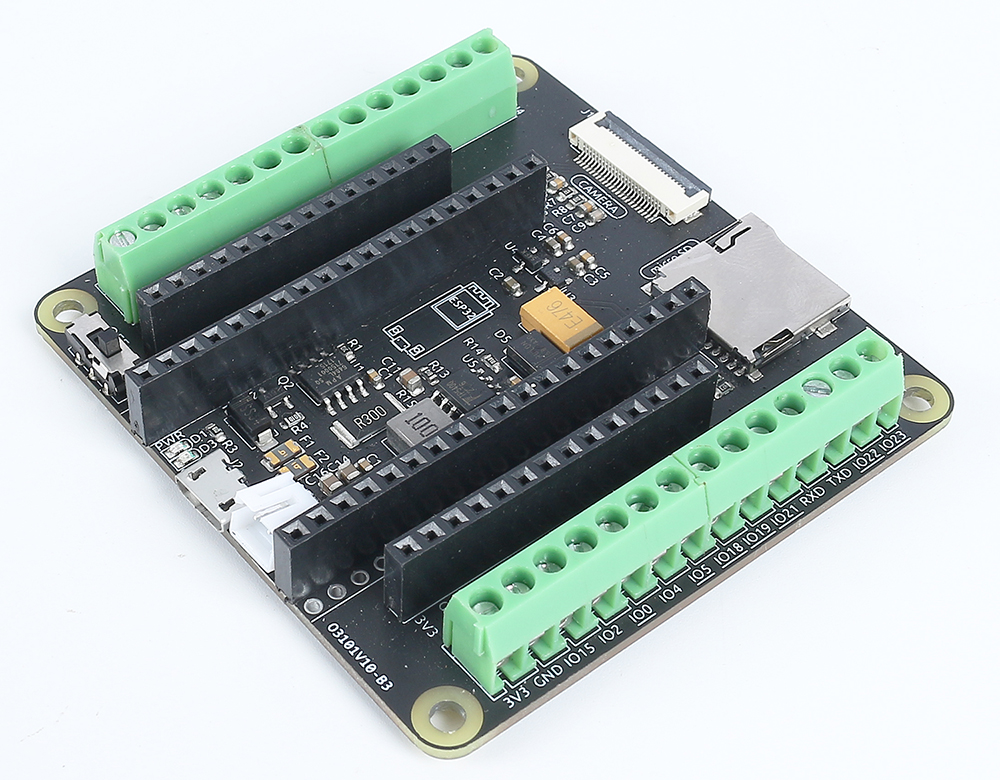
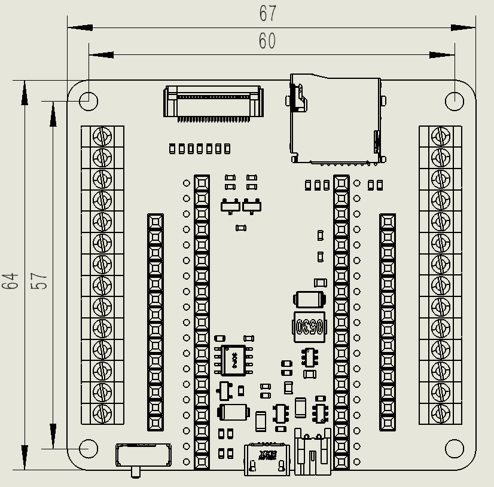
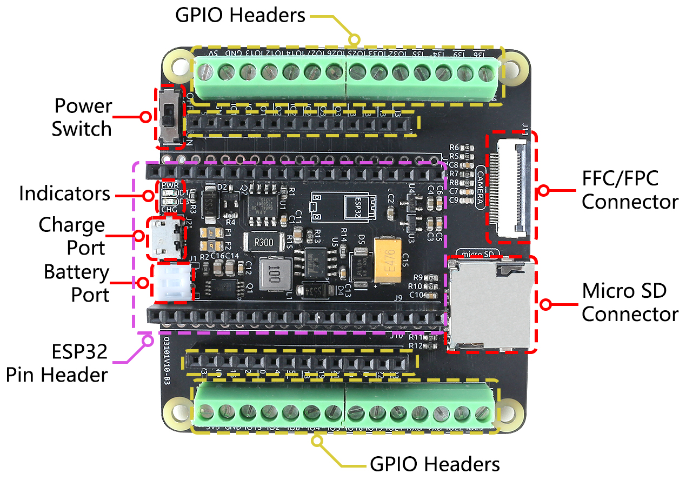

 .. note::

    Hallo, willkommen in der SunFounder Raspberry Pi & Arduino & ESP32 Enthusiasten-Community auf Facebook! Tauchen Sie tiefer in Raspberry Pi, Arduino und ESP32 mit gleichgesinnten Enthusiasten ein.

    **Warum beitreten?**

    - **Expertenunterstützung**: Lösen Sie Nachverkaufsprobleme und technische Herausforderungen mit Hilfe unserer Community und unseres Teams.
    - **Lernen & Teilen**: Tauschen Sie Tipps und Tutorials aus, um Ihre Fähigkeiten zu verbessern.
    - **Exklusive Vorschauen**: Erhalten Sie frühzeitigen Zugang zu neuen Produktankündigungen und Vorschauen.
    - **Spezielle Rabatte**: Genießen Sie exklusive Rabatte auf unsere neuesten Produkte.
    - **Festliche Aktionen und Gewinnspiele**: Nehmen Sie an Gewinnspielen und festlichen Aktionen teil.

    👉 Bereit, mit uns zu entdecken und zu kreieren? Klicken Sie auf [|link_sf_facebook|] und treten Sie noch heute bei!

.. _cpn_esp32_camera_extension:

ESP32 Kamera-Erweiterung
============================

Wir haben eine Erweiterungsplatine entwickelt, die es Ihnen ermöglicht, die Kamera- und SD-Kartenfunktionen des ESP32 WROOM 32E voll auszunutzen. Durch die Kombination der OV2640-Kamera, der Micro SD und des ESP32 WROOM 32E erhalten Sie eine All-in-One-Erweiterungsplatine.

Die Platine bietet zwei Arten von GPIO-Headern - einen mit Buchsenleisten, ideal für schnelle Prototyping-Projekte. Der andere Typ verfügt über Schraubklemmen, die stabile Drahtverbindungen gewährleisten und sie für IoT-Projekte geeignet machen.

Darüber hinaus können Sie Ihr Projekt mit einer einzigen 3,7V Batterie betreiben. Wenn die Batterie leer ist, können Sie sie bequem aufladen, indem Sie einfach ein 5V Micro USB-Kabel anschließen. Dies macht sie zu einem großartigen Werkzeug für Outdoor-Projekte und Anwendungen in abgelegenen Bereichen.

Spezifikationstabelle
-------------------------

.. list-table::
    :widths: 30 10 10 10 10
    :header-rows: 1

    *   - Parameter
        - Minimalwert
        - Typischer Wert
        - Maximalwert
        - Einheit
    *   - Batterieschaltstrom
        - \-
        - \-
        - 60
        - uA
    *   - DC-DC Ausgangsspannung
        - 4.9129
        - 5
        - 5.0889
        - V
    *   - DC-DC Übertemperaturschutz
        - \-
        - 150
        - \-
        - ℃
    *   - Batterieladestrom
        - \-
        - \-
        - 500
        - mA
    *   - Ladeschutz bei Übertemperatur
        - \-
        - 130
        - \-
        - ℃
    *   - Niederspannungsschaltschwelle
        - \-
        - 3.4
        - \-
        - V

Einführung der Schnittstellen
----------------------------------

* **Netzschalter**
    * Steuert die Stromversorgung der Batterie und schaltet sie ein und aus.

* **Ladeanschluss**
    * Beim Anschluss eines 5V/0,5A Micro USB-Kabels kann die Batterie aufgeladen werden.

* **Batterieanschluss**
    * Verfügt über eine PH2.0-2P-Schnittstelle, kompatibel mit 3,7V Lithium-Batterie.
    * Versorgt sowohl den ESP32 WROOM 32E als auch die ESP32 Kamera-Erweiterung mit Strom.

* **ESP32 Pin-Header**
    * Für das ESP32 WROOM 32E Modul vorgesehen. Achten Sie genau auf die Ausrichtung; stellen Sie sicher, dass beide Micro USB-Anschlüsse auf derselben Seite sind, um eine falsche Platzierung zu vermeiden.

* **GPIO-Header**
    * **Buchsenleisten**: Werden verwendet, um verschiedene Komponenten mit dem ESP32 zu verbinden, ideal für schnelle Prototyping-Projekte.
    * **Schraubklemmen**: 3,5mm Rastermaß 14-polige Schraubklemme, gewährleistet stabile Drahtverbindungen und ist für IoT-Projekte geeignet.

* **Anzeigelampen**
    * **PWR**: Leuchtet auf, wenn die Batterie mit Strom versorgt wird oder wenn ein Micro USB direkt in den ESP32 eingesteckt ist.
    * **CHG**: Leuchtet auf, wenn ein Micro USB an den Ladeanschluss der Platine angeschlossen wird, was den Beginn des Ladevorgangs anzeigt. Sie erlischt, sobald die Batterie vollständig aufgeladen ist.

* **Micro SD-Anschluss**
    * Federbelasteter Steckplatz für einfaches Einsetzen und Auswerfen der Micro SD-Karte.

* **24-poliger 0,5mm FFC / FPC-Anschluss**
    * Für die OV2640-Kamera konzipiert, geeignet für verschiedene visuelle Projekte.

Pin-Zuordnungstabellen
---------------------------

Das Pinout-Diagramm des ESP32 WROOM 32E finden Sie in :ref:`esp32_pinout`.

Wenn der ESP32 WROOM 32E jedoch in die Erweiterungsplatine eingesetzt wird, können einige seiner Pins auch zur Steuerung der Micro SD-Karte oder einer Kamera verwendet werden.

Daher wurden Pull-up- oder Pull-down-Widerstände zu diesen Pins hinzugefügt. Wenn Sie diese Pins als Eingänge verwenden, ist es wichtig, diese Widerstände zu berücksichtigen, da sie die Eingangspegel beeinflussen können.

.. note::

    Der onboard 8M PSRAM bietet ausreichend RAM für die Kamera. PSRAM belegt die IO16 und IO17. Daher erweitern die Erweiterungsheader und die Schraubklemmen diese Pins nicht.

Hier ist die Pinout-Tabelle für die Pins auf der rechten Seite:

    .. image:: img/esp32_extension_pinout1.jpg
        :width: 100%
        :align: center

Hier ist die Pinout-Tabelle für die Pins auf der linken Seite:

    .. image:: img/esp32_extension_pinout2.jpg
        :width: 100%
        :align: center

    .. note::

        Es gibt einige spezifische Einschränkungen:

        * **IO33** ist mit einem 4,7K Pull-up-Widerstand und einem Filterkondensator verbunden, was verhindert, dass er den WS2812 RGB-Strip steuert.

**Micro SD Anschluss Pin-Zuordnungstabelle**

.. list-table::
    :widths: 10 10
    :header-rows: 1

    *   - Micro SD Anschluss
        - ESP32
    *   - D0
        - IO2
    *   - D1
        - IO4
    *   - D2
        - IO12
    *   - D3
        - IO13
    *   - CLK
        - IO14
    *   - CMD
        - IO15

**FFC / FPC Anschluss Pin-Zuordnungstabelle**

Die Kameraschnittstelle verwendet hauptsächlich die OV2640, die mit der 8225 Kamera kompatibel ist. Die Schnittstelle verwendet einen FFC-Anschluss mit einem 0,5mm Rastermaß und 24P Flip-Down-Verbindung.

.. list-table::
    :widths: 10 10 10
    :header-rows: 1

    *   - Nummer
        - FFC / FPC Anschluss
        - ESP32
    *   - 1
        - Y0
        - NC
    *   - 2
        - Y1
        - NC
    *   - 3
        - Y4
        - IO19
    *   - 4
        - Y3
        - IO18
    *   - 5
        - Y5
        - IO21
    *   - 6
        - Y2
        - IO5
    *   - 7
        - Y6
        - IO36
    *   - 8
        - PCLK
        - IO22
    *   - 9
        - Y7
        - IO39
    *   - 10
        - DGND
        - GND
    *   - 11
        - Y8
        - IO34
    *   - 12
        - XCLK
        - IO0
    *   - 13
        - Y9
        - IO35
    *   - 14
        - DOVDD
        - 3,3V
    *   - 15
        - DVDD
        - 1,2V
    *   - 16
        - HREF
        - IO23
    *   - 17
        - PWDN
        - IO32
    *   - 18
        - VSYNC
        - IO25
    *   - 19
        - RESET
        - IO33
    *   - 20
        - SIO_C
        - IO27
    *   - 21
        - VADD
        - 2,8V
    *   - 22
        - SIO_D
        - IO26
    *   - 23
        - AGND
        - GND
    *   - 24
        - NC
        - NC

Anleitung zur Schnittstelleneinführung
------------------------------------------

**Code Hochladen**

    Wenn Sie Code auf den ESP32 WROOM 32E hochladen müssen, verbinden Sie ihn mit einem Micro-USB-Kabel mit Ihrem Computer.

    .. image:: img/plugin_esp32.png
        :width: 600
        :align: center

**Einsetzen der Micro-SD-Karte**

    Schieben Sie die Micro-SD-Karte vorsichtig ein, um sie zu sichern. Ein erneutes Drücken wird sie auswerfen.

    .. image:: img/insert_sd.png
        :width: 600
        :align: center

**Anschließen der Kamera**

    Beim Anschließen der Kamera stellen Sie sicher, dass der schwarze Streifen des FPC-Kabels nach oben zeigt und vollständig in den Anschluss eingeführt ist.

    .. raw:: html

        <video loop autoplay muted style = "max-width:100%">
            <source src="_static/video/plugin_camera.mp4" type="video/mp4">
            Your browser does not support the video tag.
        </video>

.. **Batteriebetrieb und Laden**

..     Stecken Sie das Batteriekabel vorsichtig in den Batterieanschluss, ohne zu viel Kraft anzuwenden, um zu vermeiden, dass das Batterieterminal nach oben gedrückt wird. Sollte das Terminal nach oben gedrückt werden, ist dies in Ordnung, solange die Pins nicht gebrochen sind; drücken Sie es einfach wieder in Position.

..     .. image:: img/plugin_battery.png
..         :width: 500
..         :align: center

..     Wenn die Batterie entladen ist, schließen Sie ein 5V/0,5A Micro-USB-Kabel an, um sie aufzuladen.

..     .. image:: img/battery_charge.png
..         :width: 500
..         :align: center
