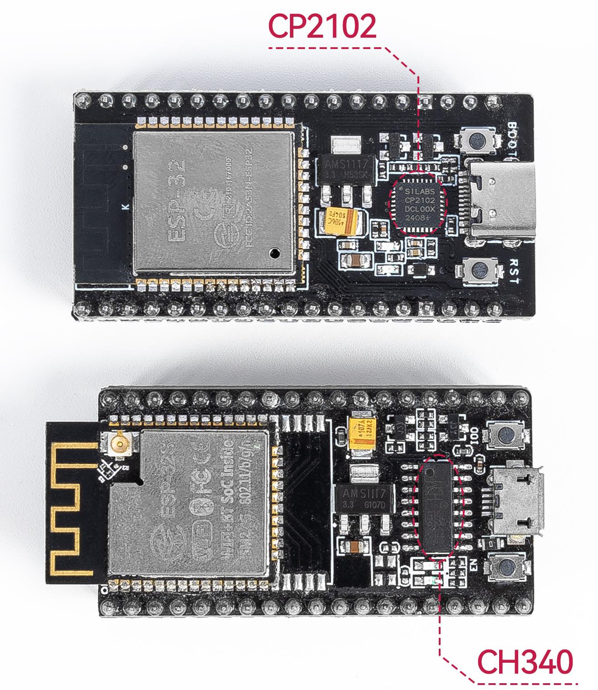

.. note::

    Hello, welcome to the SunFounder Raspberry Pi & Arduino & ESP32 Enthusiasts Community on Facebook! Dive deeper into Raspberry Pi, Arduino, and ESP32 with fellow enthusiasts.

    **Why Join?**

    - **Expert Support**: Solve post-sale issues and technical challenges with help from our community and team.
    - **Learn & Share**: Exchange tips and tutorials to enhance your skills.
    - **Exclusive Previews**: Get early access to new product announcements and sneak peeks.
    - **Special Discounts**: Enjoy exclusive discounts on our newest products.
    - **Festive Promotions and Giveaways**: Take part in giveaways and holiday promotions.

    👉 Ready to explore and create with us? Click [|link_sf_facebook|] and join today!

.. _install_driver:

Manuelle Installation des Treibers für ESP32
=============================================

Wenn Sie Ihr ESP32-Board per USB mit Ihrem Computer verbunden haben, aber **keinen Port** in der Arduino IDE oder Thonny IDE sehen (oder nur **COM1**), bedeutet dies, dass Ihr Computer das Board nicht erkannt hat.  
In diesem Fall müssen Sie den USB-Treiber manuell installieren.

Wir bieten zwei Arten von ESP32-Boards an, die sich nur durch ihren USB-zu-Seriell-Chip unterscheiden:

- **CP2102**
- **CH340**

Funktional arbeiten sie gleich – der einzige Unterschied ist der benötigte USB-Treiber.

* Wenn Ihr ESP32-Board den **CH340**-USB-Chip verwendet, folgen Sie dieser Anleitung zur Treiberinstallation:

  * :ref:`driver_ch340`

* Wenn Ihr ESP32-Board den **CP2102**-USB-Chip verwendet, folgen Sie stattdessen dieser Anleitung:

  * :ref:`driver_cp2102`

.. _driver_ch340:

CH340-Treiber installieren
---------------------------

In diesem Abschnitt zeigen wir, wie Sie CH340-Treiber auf verschiedenen Betriebssystemen installieren. Bei vielen Nutzern erfolgt die Installation automatisch. Je nach Systemkonfiguration kann jedoch eine manuelle Installation erforderlich sein.

Treiber
^^^^^^^^^^^^

Der CH340-Chip wird von WCH hergestellt. Hier sind die offiziellen Treiber für verschiedene Betriebssysteme:

* `Windows (ZIP) <https://www.wch.cn/download/file?id=5>`_ – Treiber v3.4 (2024-10-16)
* `Windows (EXE) <https://www.wch.cn/download/file?id=65>`_ – Installationsprogramm
* `Mac (ZIP) <https://www.wch.cn/download/file?id=178>`_ – Treiber v1.5 (2025-02-26)
* `Linux (ZIP) <https://www.wch.cn/download/file?id=177>`_ – Treiber v1.5 (2024-10-24)

Sie können auch die Website von WCH besuchen, um die neuesten Treiber herunterzuladen:

* `WCH Treiber-Download <https://www.wch.cn/downloads/CH343SER_EXE.html>`_

Wenn Sie Google Chrome verwenden, können Sie die Seite automatisch übersetzen lassen.

Windows 7/11
^^^^^^^^^^^^^^^^^^^^^

#. Laden Sie den Treiber herunter:

   * `Windows (ZIP) <https://www.wch.cn/download/file?id=5>`_
   * `Windows (EXE) <https://www.wch.cn/download/file?id=65>`_

#. Doppelklicken Sie auf die ``.exe``-Datei. Wenn Sie die ZIP-Version heruntergeladen haben, extrahieren Sie diese zuerst.

#. Klicken Sie zuerst auf „Uninstall“, um vorherige Treiber zu entfernen, und dann auf „Install“.

   .. image:: img/driver_ch340_install.png

#. Öffnen Sie den **Geräte-Manager** (⊞ Win + R drücken, „device manager“ eingeben, Enter drücken).

   .. image:: img/driver_ch340_device.png

#. Unter **Anschlüsse (COM & LPT)** sollte **USB-SERIAL CH340 (COM##)** angezeigt werden.

   .. image:: img/driver_ch340_com.png

macOS
^^^^^^^^^^^^

#. Laden Sie den Treiber herunter und entpacken Sie ihn:

   * `Mac (ZIP) <https://www.wch.cn/download/file?id=178>`_

#. Öffnen Sie den Ordner und doppelklicken Sie auf die ``.pkg``-Datei.

   .. note::

      Wenn eine Warnung wie „Systemerweiterung blockiert“ erscheint, gehen Sie zu **Systemeinstellungen > Datenschutz & Sicherheit** und klicken Sie auf **Zulassen**.
      Eventuell müssen Sie Ihr Passwort eingeben und den Mac anschließend neu starten.

   .. image:: img/driver_ch340_install_mac.png
      :width: 500
      :align: center

#. Zur Überprüfung öffnen Sie das Terminal und führen Sie folgenden Befehl aus:

   .. code-block::

      ls /dev/cu*

#. Sie sollten ein Gerät wie ``/dev/cu.usbserial*****`` sehen.

   .. image:: img/driver_ch340_mac_port.png
      :width: 500
      :align: center

Linux
^^^^^^^^^^^

#. Die meisten Linux-Distributionen enthalten bereits Unterstützung für CH340. Wenn nicht, führen Sie ein Update durch:

   .. code-block::

      sudo apt-get update
      sudo apt-get upgrade

#. Alternativ können Sie den Treiber manuell installieren:

   * `Linux (ZIP) <https://www.wch.cn/download/file?id=177>`_

#. Verbinden Sie das ESP32-Board erneut und führen Sie folgenden Befehl aus:

   .. code-block::

      ls /dev/ttyUSB*

#. Bei funktionierendem Treiber sollte ein Eintrag wie ``/dev/ttyUSB0`` erscheinen.

.. _driver_cp2102:

So installieren Sie den CP2102-Treiber
---------------------------------------

Diese Anleitung führt Sie durch die Schritte zur Installation des USB-zu-Seriell-Treibers CP2102 auf verschiedenen Betriebssystemen.  
In vielen Fällen wird der Treiber automatisch vom Betriebssystem installiert. Je nach Systemversion oder Konfiguration kann es jedoch erforderlich sein, den Treiber manuell zu installieren, wenn Sie das CP2102-Gerät zum ersten Mal mit dem Computer verbinden.

Windows
^^^^^^^^^^^^^

#. Besuchen Sie die Seite `Silicon Labs USB to UART Bridge VCP Drivers <https://www.silabs.com/developers/usb-to-uart-bridge-vcp-drivers?tab=downloads>`_ und laden Sie den **CP210x_Universal_Windows_Driver** herunter.

#. Entpacken Sie die ZIP-Datei, klicken Sie mit der rechten Maustaste auf die Datei ``.inf`` und wählen Sie **Installieren**. Folgen Sie den Anweisungen auf dem Bildschirm, um die Installation abzuschließen.

   .. image:: img/driver_cp2102_install.png

#. Nach der Installation verbinden Sie Ihr CP2102-Gerät mit einem USB-Port. Öffnen Sie den **Geräte-Manager** (⊞ Win + R drücken, ``devmgmt.msc`` eingeben und Enter drücken).

#. Erweitern Sie den Abschnitt **Anschlüsse (COM & LPT)**. Dort sollte ein Eintrag wie ``Silicon Labs CP210x USB to UART Bridge (COM#)`` erscheinen.

   .. image:: img/driver_cp2102_com.png

#. Wenn das Gerät ohne Warnsymbol angezeigt wird, wurde der Treiber erfolgreich installiert und funktioniert einwandfrei.

macOS
^^^^^^^^^^^^

Die CP2102 USB-zu-UART-Schnittstelle wird von Silicon Labs hergestellt. In neueren macOS-Versionen ist grundlegende Unterstützung enthalten, jedoch wird für vollständige Kompatibilität empfohlen, den offiziellen Treiber zu installieren.

#. Besuchen Sie die Seite `USB to UART Bridge VCP Drivers <https://www.silabs.com/developer-tools/usb-to-uart-bridge-vcp-drivers?tab=downloads>`_ und laden Sie den **CP210x VCP Mac OSX Driver** für Ihr System (Apple Silicon oder Intel) herunter.

#. Entpacken Sie die heruntergeladene ZIP-Datei, doppelklicken Sie auf die enthaltene ``.dmg``-Datei, um sie bereitzustellen.

#. Öffnen Sie das bereitgestellte Volume und führen Sie **Install CP210x VCP Driver.app** aus.

#. Folgen Sie den Anweisungen zur Installation.

   .. image:: img/driver_cp2102_mac_install.png
      :width: 500

#. Ab macOS 10.13 kann das System die Treibererweiterung blockieren. Wenn Sie dazu aufgefordert werden:

   * Gehen Sie zu **Systemeinstellungen > Datenschutz & Sicherheit**
   * Klicken Sie auf **Zulassen** neben der Silicon Labs-Erweiterung
   * Entsperren Sie die Einstellungen bei Bedarf (Schlosssymbol anklicken und Passwort eingeben)
   * Starten Sie den Mac neu, um die Änderungen zu übernehmen

#. Nach der Installation starten Sie Ihren Mac neu, falls noch nicht geschehen.

#. Um zu prüfen, ob der Treiber installiert wurde, öffnen Sie das Terminal und führen Sie aus:

   .. code-block::

      ls /dev/cu.*

#. Sie sollten ein Gerät wie dieses sehen, was auf eine funktionierende Installation hinweist:

   .. code-block::

      /dev/cu.SLAB_USBtoUART

Linux
^^^^^^^^^^^^^

#. Die meisten Linux-Distributionen (z. B. Ubuntu, Debian, Fedora) enthalten bereits Unterstützung für den CP2102-Treiber. In den meisten Fällen reicht es, das Gerät anzuschließen.

#. Wird das Gerät nicht erkannt, aktualisieren Sie Ihr System:

   .. code-block::

      sudo apt-get update
      sudo apt-get upgrade

#. Schließen Sie das CP2102-Gerät erneut an und führen Sie im Terminal folgenden Befehl aus:

   .. code-block::

      ls /dev/ttyUSB*

#. Wenn der Treiber funktioniert, sollten Sie ein Gerät wie dieses sehen:

   .. code-block::

      /dev/ttyUSB0

#. Sie können auch die Kernel-Protokolle überprüfen, um die Erkennung zu bestätigen:

   .. code-block::

      dmesg | grep ttyUSB

