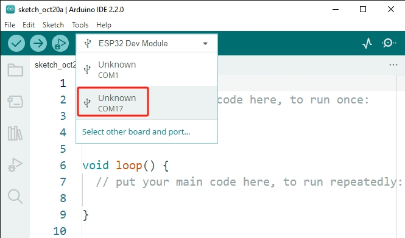

.. note::

    Hallo, willkommen in der SunFounder Raspberry Pi & Arduino & ESP32 Enthusiasten-Gemeinschaft auf Facebook! Vertiefen Sie sich mit anderen Enthusiasten in die Welt von Raspberry Pi, Arduino und ESP32.

    **Warum beitreten?**

    - **Expertenunterstützung**: Lösen Sie Nachverkaufsprobleme und technische Herausforderungen mit Hilfe unserer Gemeinschaft und unseres Teams.
    - **Lernen & Teilen**: Tauschen Sie Tipps und Tutorials aus, um Ihre Fähigkeiten zu verbessern.
    - **Exklusive Vorschauen**: Erhalten Sie frühzeitigen Zugang zu neuen Produktankündigungen und exklusiven Einblicken.
    - **Sonderangebote**: Genießen Sie exklusive Rabatte auf unsere neuesten Produkte.
    - **Festliche Aktionen und Gewinnspiele**: Nehmen Sie an Gewinnspielen und Feiertagsaktionen teil.

    👉 Bereit, mit uns zu erkunden und zu kreieren? Klicken Sie auf [|link_sf_facebook|] und treten Sie heute bei!

.. _unknown_com_port:

Immer „Unknown COMxx“ angezeigt?
=========================================

Warum wird beim Anschließen des ESP32 an den Computer in der Arduino IDE oft „Unknown COMxx“ angezeigt?

.. note::

   Wenn „Unbekanntes COMxx“ oder kein Port angezeigt wird, erkennt Ihr Computer möglicherweise das Board nicht. Siehe :ref:`install_driver`.

Dies liegt daran, dass der USB-Treiber für den ESP32 sich von den regulären Arduino-Boards unterscheidet. Die Arduino IDE kann dieses Board nicht automatisch erkennen.

In einem solchen Szenario müssen Sie das richtige Board manuell auswählen, indem Sie diesen Schritten folgen:

#. Klicken Sie auf **„Wählen Sie ein anderes Board und einen anderen Port“**.

    .. image:: img/unknown_select.png

#. Geben Sie in der Suche **„esp32 dev module“** ein, wählen Sie das erscheinende Board aus. Wählen Sie danach den richtigen Port und klicken Sie auf **OK**.

    .. image:: img/unknown_board.png

#. Nun sollten Sie Ihr Board und Ihren Port in diesem Schnellansichtsfenster sehen können.

    .. image:: img/unknown_correct.png