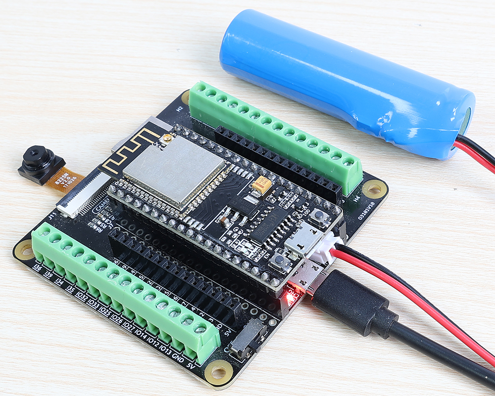

 .. note::

    こんにちは！ SunFounder Raspberry Pi & Arduino & ESP32 Enthusiasts Community on Facebookへようこそ！ 一緒にRaspberry Pi、Arduino、ESP32の世界を深く探求しましょう。

    **参加する理由**

    - **専門家サポート**：コミュニティやチームの助けを借りて、販売後の問題や技術的な課題を解決できます。
    - **学びと共有**：スキルを向上させるためのヒントやチュートリアルを交換できます。
    - **独占プレビュー**：新製品の発表や先行情報に早期アクセスできます。
    - **特別割引**：最新の製品に対する特別割引をお楽しみください。
    - **フェスティバルプロモーションとプレゼント**：プレゼントやホリデープロモーションに参加できます。

    👉 私たちと一緒に探求し、創造する準備ができましたか？ [|link_sf_facebook|] をクリックして今日参加しましょう！

SunFounder |link_Camera_Pro_Kit|
==================================================

* |link_ESP32_Camera_Pro_Kit|

|link_Camera_Pro_Kit| をお選びいただきありがとうございます。

このESP32 Camera Proキットは、ロボティクスからIoT、Bluetoothアプリケーションまで、さまざまなプロジェクトに対応できるよう設計されています。強力なESP32 WROOM 32Eモジュールと、実験や接続が簡単に行える拡張ボードを備えています。画像処理タスク用のOV2640カメラモジュールと、モバイルアプリケーション用の充電式バッテリーインターフェースが含まれています。MicroSDカードとカメラスロットも備えたこのキットは、高度なエレクトロニクスを簡単かつ効率的に探求したい開発者にとって、包括的なソリューションを提供します。

.. note::
    このドキュメントは以下の言語でご利用いただけます。

        * |link_en_tutorials|
        * |link_german_tutorials|
        * |link_jp_tutorials|

    
    ご希望の言語のリンクをクリックして、ドキュメントにアクセスしてください。

.. toctree::
    :maxdepth: 1

    About this Kit <self>
    component_esp32
    component_esp32_extension
    component_battery
    component_camera
    projects/projects
    arduino_video_course/arduino_video_course
    faq/faq

著作権通知
-----------------------

このマニュアルの内容は、テキスト、画像、コードなどを含め、すべてSunFounder社の所有物です。これを個人の学習、調査、楽しみ、またはその他の非営利目的でのみ使用し、関連する規則および著作権法の下で、著者および関連権利者の法的権利を侵害しない範囲で使用してください。許可なくこれらを商業利益のために使用する個人または組織に対しては、当社は法的措置を取る権利を留保します。
