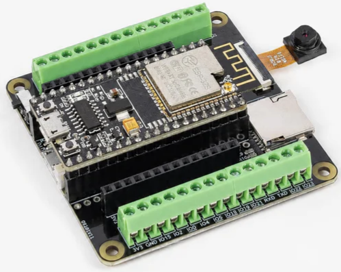

 .. note::

    Hallo, willkommen in der SunFounder Raspberry Pi & Arduino & ESP32 Enthusiasten Community auf Facebook! Tauchen Sie mit anderen Enthusiasten tiefer in Raspberry Pi, Arduino und ESP32 ein.

    **Warum mitmachen?**

    - **Expertenunterstützung**: Lösen Sie nach dem Kauf Probleme und technische Herausforderungen mit Hilfe unserer Community und unseres Teams.
    - **Lernen & Teilen**: Tauschen Sie Tipps und Tutorials aus, um Ihre Fähigkeiten zu verbessern.
    - **Exklusive Vorschauen**: Erhalten Sie frühzeitigen Zugang zu neuen Produktankündigungen und Sneak Peeks.
    - **Exklusive Rabatte**: Genießen Sie exklusive Rabatte auf unsere neuesten Produkte.
    - **Festliche Aktionen und Gewinnspiele**: Nehmen Sie an Gewinnspielen und Feiertagsaktionen teil.

    👉 Bereit, mit uns zu erkunden und zu kreieren? Klicken Sie auf [|link_sf_facebook|] und treten Sie noch heute bei!

SunFounder |link_Camera_Pro_Kit|
==================================================

* |link_ESP32_Camera_Pro_Kit|

Vielen Dank, dass Sie sich für unser |link_Camera_Pro_Kit| entschieden haben.

Dieses ESP32 Kamera Pro Kit ist darauf ausgelegt, eine Vielzahl von Projekten zu unterstützen, von Robotik bis hin zu IoT- und Bluetooth-Anwendungen. Es verfügt über das leistungsstarke ESP32 WROOM 32E Modul, kombiniert mit einer Erweiterungsplatine, die einfaches Experimentieren und Konnektivität ermöglicht. Das Kit enthält ein OV2640 Kameramodul für Bildverarbeitungsaufgaben und eine wiederaufladbare Batterie-Schnittstelle für mobile Anwendungen. Mit Steckplätzen für eine MicroSD-Karte und eine Kamera bietet dieses Kit eine umfassende Lösung für Entwickler, die fortgeschrittene Elektronik einfach und effizient erkunden möchten.

.. note::
    Dieses Dokument ist in den folgenden Sprachen verfügbar.

        * |link_en_tutorials|
        * |link_german_tutorials|
        * |link_jp_tutorials|

    
    Bitte klicken Sie auf die entsprechenden Links, um das Dokument in Ihrer bevorzugten Sprache zu öffnen.

.. toctree::
    :maxdepth: 1

    About this Kit <self>
    component_esp32
    component_esp32_extension
    component_camera
    projects/projects
    arduino_video_course/arduino_video_course
    faq/faq

Urheberrechtshinweis
-------------------------

Alle Inhalte, einschließlich, aber nicht beschränkt auf Texte, Bilder und Code in diesem Handbuch, sind Eigentum der SunFounder Company. Sie dürfen diese nur für persönliche Studien, Recherchen, Vergnügen oder andere nicht-kommerzielle oder gemeinnützige Zwecke gemäß den geltenden Vorschriften und Urheberrechtsgesetzen verwenden, ohne die gesetzlichen Rechte des Autors und der relevanten Rechteinhaber zu verletzen. Für jede Person oder Organisation, die diese Inhalte ohne Genehmigung kommerziell nutzt, behält sich das Unternehmen das Recht vor, rechtliche Schritte einzuleiten.
