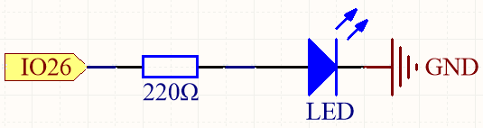
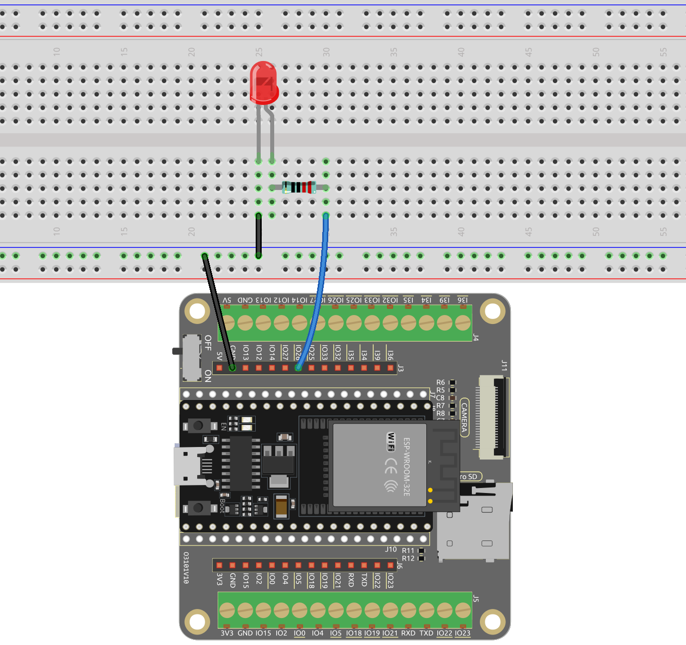

.. note::

    Hallo, willkommen in der SunFounder Raspberry Pi & Arduino & ESP32 Enthusiasten-Gemeinschaft auf Facebook! Vertiefen Sie sich mit anderen Enthusiasten in die Welt von Raspberry Pi, Arduino und ESP32.

    **Warum beitreten?**

    - **Expertenunterstützung**: Lösen Sie Nachverkaufsprobleme und technische Herausforderungen mit Hilfe unserer Gemeinschaft und unseres Teams.
    - **Lernen & Teilen**: Tauschen Sie Tipps und Tutorials aus, um Ihre Fähigkeiten zu verbessern.
    - **Exklusive Vorschauen**: Erhalten Sie frühzeitigen Zugang zu neuen Produktankündigungen und exklusiven Einblicken.
    - **Sonderangebote**: Genießen Sie exklusive Rabatte auf unsere neuesten Produkte.
    - **Festliche Aktionen und Gewinnspiele**: Nehmen Sie an Gewinnspielen und Feiertagsaktionen teil.

    👉 Bereit, mit uns zu erkunden und zu kreieren? Klicken Sie auf [|link_sf_facebook|] und treten Sie heute bei!

.. _ar_blink:

2.1 Digitaler Ausgang
=======================================

Unter den vielen Mikrocontroller-Entwicklungsboards zeichnet sich der ESP32 durch seine hohe Leistung und Vielseitigkeit aus. Dieses Projekt zeigt, wie Sie die digitalen Ausgabepins des ESP32-Boards verwenden, um ein externes Gerät zu steuern – in diesem Fall eine LED zum Leuchten zu bringen. Dies dient als Grundlage für das Erlernen der ESP32-Programmierung und als Einstieg in die Erforschung von IoT-Anwendungen.

**Verfügbare Pins**

Hier ist eine Liste der verfügbaren Pins auf dem ESP32-Board für dieses Projekt.

.. list-table::
    :widths: 5 20 

    * - Verfügbare Pins
      - IO13, IO12, IO14, IO27, IO26, IO25, IO33, IO32, IO15, IO2, IO0, IO4, IO5, IO18, IO19, IO21, IO22, IO23

**Benötigte Komponenten**

In diesem Projekt benötigen wir die folgenden Komponenten.

.. list-table::
    :widths: 30 20
    :header-rows: 1

    *   - KOMPONENTEN-BESCHREIBUNG
        - KAUFLINK

    *   - :ref:`cpn_esp32_wroom_32e`
        - |link_esp32_wroom_32e_buy|
    *   - :ref:`cpn_esp32_camera_extension`
        - \-
    *   - Breadboard
        - |link_breadboard_buy|
    *   - Mehrere Verbindungskabel
        - |link_wires_buy|
    *   - Widerstand
        - |link_resistor_buy|
    *   - LED
        - |link_led_buy|

**Schaltplan**

Dieser Schaltkreis funktioniert nach einem einfachen Prinzip, und die Stromrichtung ist in der Abbildung gezeigt. Die LED leuchtet nach dem 220-Ohm-Strombegrenzungswiderstand auf, wenn Pin 26 ein hohes Signal ausgibt. Die LED erlischt, wenn Pin 26 ein niedriges Signal ausgibt.

**Verkabelung**

**Code hochladen**

#. |link_download_this_code| herunter oder kopieren Sie ihn direkt in die Arduino IDE.

    .. note::
        
        * :ref:`unknown_com_port`

    .. raw:: html

        <iframe src=https://create.arduino.cc/editor/sunfounder01/1bff2463-40ad-43c1-8815-9f448bab3735/preview?embed style="height:510px;width:100%;margin:10px 0" frameborder=0></iframe>
    
#. Verbinden Sie dann den ESP32 WROOM 32E mit Ihrem Computer über ein Mikro-USB-Kabel.

    * :ref:`unknown_com_port`

    .. image:: img/plugin_esp32.png
        :width: 600
        :align: center

#. Wählen Sie das Board (ESP32 Dev Module) und den entsprechenden Port aus.

    .. image:: img/choose_board.png

#. Klicken Sie nun auf die Schaltfläche **Hochladen**, um den Code auf das ESP32-Board hochzuladen.
    
    .. image:: img/click_upload.png

#. Nachdem der Code erfolgreich hochgeladen wurde, sehen Sie die LED blinken.

**Wie funktioniert das?**

#. Deklarieren Sie eine ganzzahlige Konstante namens ``ledPin`` und weisen Sie ihr den Wert 26 zu.

    .. code-block:: arduino

        const int ledPin = 26;  // Der GPIO-Pin für die LED

#. Initialisieren Sie nun den Pin in der Funktion ``setup()``, wobei Sie den Pin auf den Modus ``OUTPUT`` setzen müssen.

    .. code-block:: arduino

        void setup() {
            pinMode(ledPin, OUTPUT);
        }

    * ``void pinMode(uint8_t pin, uint8_t mode);``: Diese Funktion wird verwendet, um den GPIO-Betriebsmodus für einen bestimmten Pin festzulegen.

        * ``pin`` definiert die GPIO-Pin-Nummer.
        * ``mode`` legt den Betriebsmodus fest.

        Die folgenden Modi werden für die grundlegende Ein- und Ausgabe unterstützt:

        * ``INPUT`` setzt den GPIO als Eingang ohne Pullup oder Pulldown (hoher Widerstand).
        * ``OUTPUT`` setzt den GPIO auf Ausgangs-/Lesemodus.
        * ``INPUT_PULLDOWN`` setzt den GPIO als Eingang mit internem Pulldown.
        * ``INPUT_PULLUP`` setzt den GPIO als Eingang mit internem Pullup.

#. Die Funktion ``loop()`` enthält die Hauptlogik des Programms und wird kontinuierlich ausgeführt. Sie wechselt zwischen dem Setzen des Pins auf HIGH und LOW, mit einsekündigen Intervallen dazwischen.

    .. code-block:: arduino

        void loop() {
            digitalWrite(ledPin, HIGH);   // turn the LED on (HIGH is the voltage level)
            delay(1000);                       // wait for a second
            digitalWrite(ledPin, LOW);    // turn the LED off by making the voltage LOW
            delay(1000);                       // wait for a second
        }

    * ``void digitalWrite(uint8_t pin, uint8_t val);``: Diese Funktion setzt den Zustand des ausgewählten GPIO auf ``HIGH`` oder ``LOW``. Diese Funktion wird nur verwendet, wenn der ``pinMode`` als ``OUTPUT`` konfiguriert wurde.
    
        * ``pin`` definiert die GPIO-Pin-Nummer.
        * ``val`` setzt den digitalen Ausgangszustand auf ``HIGH`` oder ``LOW``.
