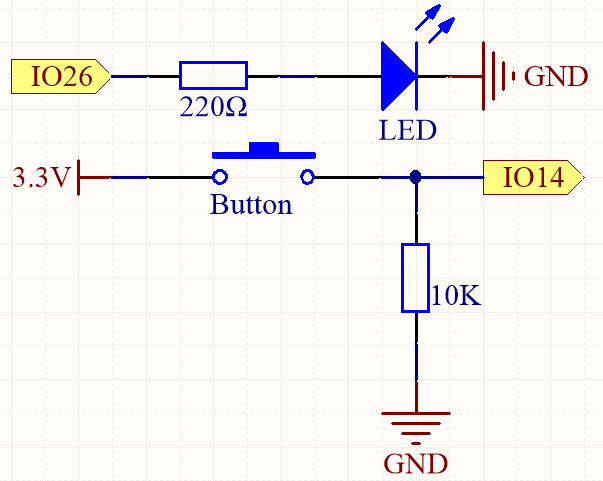
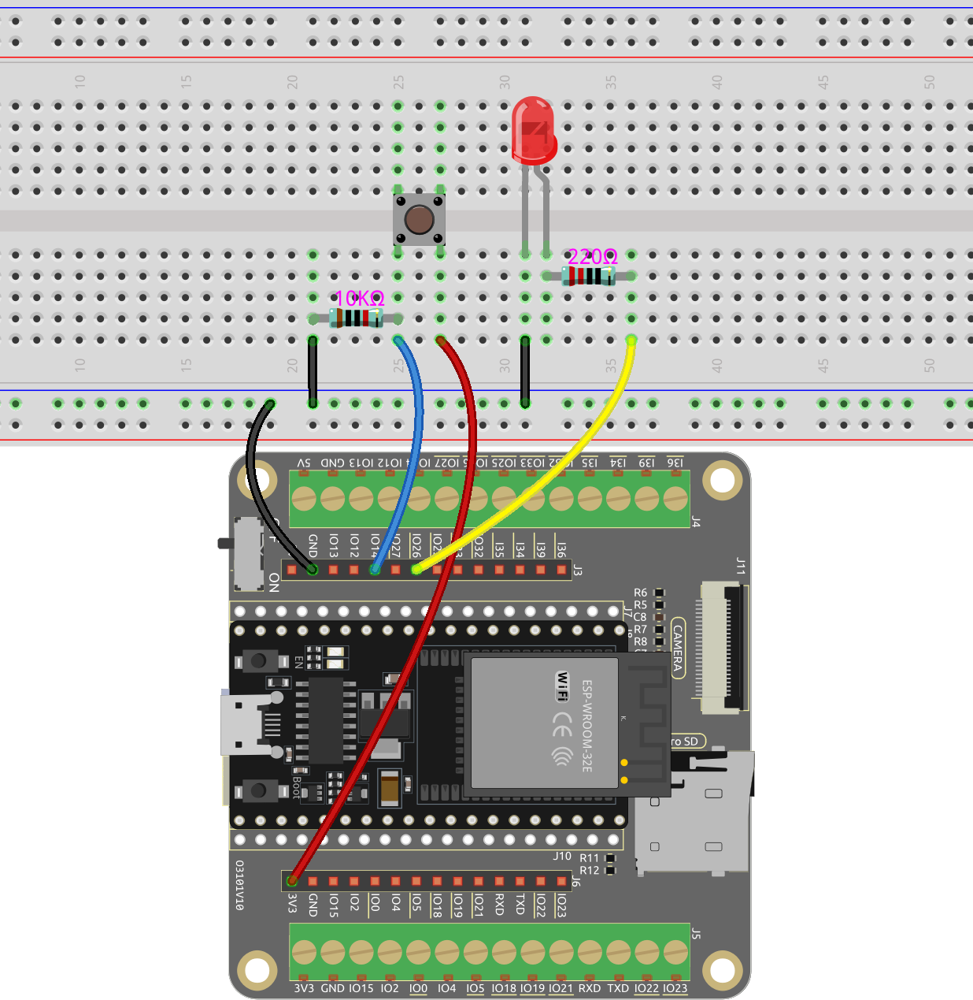
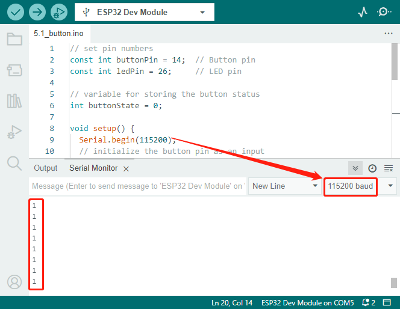

 .. note::

    Hallo, willkommen in der SunFounder Raspberry Pi & Arduino & ESP32 Enthusiasten-Gemeinschaft auf Facebook! Vertiefen Sie sich mit anderen Enthusiasten in die Welt von Raspberry Pi, Arduino und ESP32.

    **Warum beitreten?**

    - **Expertenunterstützung**: Lösen Sie Nachverkaufsprobleme und technische Herausforderungen mit Hilfe unserer Gemeinschaft und unseres Teams.
    - **Lernen & Teilen**: Tauschen Sie Tipps und Tutorials aus, um Ihre Fähigkeiten zu verbessern.
    - **Exklusive Vorschauen**: Erhalten Sie frühzeitigen Zugang zu neuen Produktankündigungen und exklusiven Einblicken.
    - **Sonderangebote**: Genießen Sie exklusive Rabatte auf unsere neuesten Produkte.
    - **Festliche Aktionen und Gewinnspiele**: Nehmen Sie an Gewinnspielen und Feiertagsaktionen teil.

    👉 Bereit, mit uns zu erkunden und zu kreieren? Klicken Sie auf [|link_sf_facebook|] und treten Sie heute bei!

.. _ar_button:

2.3 Digitaler Eingang
============================

In diesem interaktiven Projekt erkunden wir die Verwendung digitaler Eingaben durch Tastensteuerungen, um eine LED zu steuern. Die Bedienung ist einfach, aber leistungsstark. Wir werden den Zustand einer Taste überwachen; wenn sie gedrückt wird, registriert sie ein hohes Spannungsniveau, bekannt als 'High State'. Diese Zustandsänderung dient als Auslöser, um eine LED zum Leuchten zu bringen. Indem Sie lernen, diesen digitalen Eingang zu lesen, gewinnen Sie ein grundlegendes Verständnis dafür, wie Mikrocontroller mit externen Geräten interagieren können. Dieses Projekt führt nicht nur in grundlegende elektronische Konzepte ein, sondern bereitet auch den Weg für komplexere Steuerungssysteme mit mehreren Eingängen und Ausgängen.

**Verfügbare Pins**

* **Verfügbare Pins**

    Hier ist eine Liste der verfügbaren Pins auf dem ESP32-Board für dieses Projekt.

    .. list-table::
        :widths: 5 20

        *   - Für Eingänge
            - IO14, IO25, I35, I34, I39, I36, IO18, IO19, IO21, IO22, IO23
        *   - Für Ausgänge
            - IO13, IO12, IO14, IO27, IO26, IO25, IO33, IO32, IO15, IO2, IO0, IO4, IO5, IO18, IO19, IO21, IO22, IO23
    
* **Bedingte Verwendungspins (Eingang)**

    Die folgenden Pins haben eingebaute Pull-up- oder Pull-down-Widerstände, sodass keine externen Widerstände erforderlich sind, wenn **sie als Eingangspins verwendet werden**:

    .. list-table::
        :widths: 5 15
        :header-rows: 1

        *   - Bedingte Verwendungspins
            - Beschreibung
        *   - IO13, IO15, IO2, IO4
            - Pull-up mit einem 47K-Widerstand setzt den Wert standardmäßig auf High.
        *   - IO27, IO26, IO33
            - Pull-up mit einem 4.7K-Widerstand setzt den Wert standardmäßig auf High.
        *   - IO32
            - Pull-down mit einem 1K-Widerstand setzt den Wert standardmäßig auf Low.

* **Strapping-Pins (Eingang)**

    Strapping-Pins sind eine spezielle Gruppe von Pins, die verwendet werden, um spezifische Boot-Modi während des Geräte-Starts 
    (d.h. Power-on-Reset) festzulegen.
     
    .. list-table::
        :widths: 5 15

        *   - Strapping-Pins
            - IO5, IO0, IO2, IO12, IO15 
    
    Generell wird **nicht empfohlen, sie als Eingangspins zu verwenden**. Wenn Sie diese Pins verwenden möchten, berücksichtigen Sie die möglichen Auswirkungen auf den Boot-Prozess. Weitere Einzelheiten finden Sie im Abschnitt :ref:`esp32_strapping`.

**Benötigte Komponenten**

In diesem Projekt benötigen wir die folgenden Komponenten.

.. list-table::
    :widths: 30 20
    :header-rows: 1

    *   - KOMPONENTEN-BESCHREIBUNG
        - KAUFLINK

    *   - :ref:`cpn_esp32_wroom_32e`
        - |link_esp32_wroom_32e_buy|
    *   - :ref:`cpn_esp32_camera_extension`
        - \-
    *   - Breadboard
        - |link_breadboard_buy|
    *   - Mehrere Verbindungskabel
        - |link_wires_buy|
    *   - Widerstand
        - |link_resistor_buy|
    *   - LED
        - |link_led_buy|
    *   - Taster
        - |link_button_buy|

**Schaltplan**

Um eine ordnungsgemäße Funktion sicherzustellen, verbinden Sie eine Seite des Taster-Pins mit 3,3 V und die andere Seite mit IO14. Wenn der Taster gedrückt wird, wird IO14 auf High gesetzt, wodurch die LED aufleuchtet. Wenn der Taster losgelassen wird, kehrt IO14 in seinen schwebenden Zustand zurück, der entweder High oder Low sein kann. Um ein stabiles Low-Level zu gewährleisten, wenn der Taster nicht gedrückt wird, sollte IO14 über einen 10K-Pull-down-Widerstand mit GND verbunden werden.

**Verdrahtung**

.. note::
    
    Ein Vier-Pin-Taster ist in H-Form gestaltet. Wenn der Taster nicht gedrückt wird, sind die linken und rechten Pins getrennt, und es kann kein Strom zwischen ihnen fließen. Wenn der Taster jedoch gedrückt wird, sind die linken und rechten Pins verbunden und bilden einen Strompfad.

**Code**

|link_download_this_code| herunter oder kopieren Sie ihn direkt in die Arduino IDE.
    
.. note::
    
    * :ref:`unknown_com_port`
 
.. raw:: html

    <iframe src=https://create.arduino.cc/editor/sunfounder01/702c5a70-78e7-4a8b-a0c7-10c0acebfc12/preview?embed style="height:510px;width:100%;margin:10px 0" frameborder=0></iframe>

Denken Sie daran, die serielle Kommunikationsgeschwindigkeit auf 115200 einzustellen.

Nachdem der Code erfolgreich hochgeladen wurde, leuchtet die LED auf, wenn Sie den Taster drücken, und erlischt, wenn Sie ihn loslassen.

Gleichzeitig können Sie den Serial Monitor in der oberen rechten Ecke öffnen, um den Wert des Tasters zu beobachten. Wenn der Taster gedrückt wird, wird "1" angezeigt, andernfalls "0".

**Wie es funktioniert**

Die vorherigen Projekte beinhalteten alle das Ausgeben von Signalen, entweder in Form 
von digitalen oder PWM-Signalen.

Dieses Projekt umfasst das Empfangen von Eingangssignalen von externen Komponenten zum 
ESP32-Board. Sie können das Eingangssignal über den Serial Monitor in der Arduino IDE anzeigen.

#. In der Funktion ``setup()`` wird der Taster-Pin als ``Eingang`` und der LED-Pin als ``Ausgang`` initialisiert. Die serielle Kommunikation wird ebenfalls mit einer Baudrate von 115200 gestartet.

    .. code-block:: arduino

        void setup() {
            Serial.begin(115200);
            // initialisiere den Taster-Pin als Eingang
            pinMode(buttonPin, INPUT);
            // initialisiere den LED-Pin als Ausgang
            pinMode(ledPin, OUTPUT);
        }
    
    * ``Serial.begin(speed)``: Legt die Datenrate in Bits pro Sekunde (Baud) für die serielle Datenübertragung fest.

        * ``speed``: in Bits pro Sekunde (Baud). Erlaubte Datentypen: ``long``.

#. In der Funktion ``loop()`` wird der Zustand des Tasters gelesen und in der Variablen ``buttonState`` gespeichert. Der Wert von ``buttonState`` wird mit ``Serial.println()`` an den Serial Monitor ausgegeben.

    .. code-block:: arduino

        void loop() {
            // den Zustand des Tasters lesen
            buttonState = digitalRead(buttonPin);
            Serial.println(buttonState);
            delay(100);
            // wenn der Taster gedrückt wird, ist buttonState HIGH
            if (buttonState == HIGH) {
                // LED einschalten
                digitalWrite(ledPin, HIGH);
            } else {
                // LED ausschalten
                digitalWrite(ledPin, LOW);
            }
        }

    Wenn der Taster gedrückt wird und ``buttonState`` HIGH ist, wird die LED durch Setzen von ``ledPin`` auf ``HIGH`` eingeschaltet. Andernfalls wird die LED ausgeschaltet.

    * ``int digitalRead(uint8_t pin);``: Um den Zustand eines als EINGANG konfigurierten Pins zu lesen, wird die Funktion digitalRead verwendet. Diese Funktion gibt den logischen Zustand des ausgewählten Pins als ``HIGH`` oder ``LOW`` zurück.

        * ``pin``: Wählt GPIO

    * ``Serial.println()``: Gibt Daten als lesbaren ASCII-Text an den seriellen Port aus, gefolgt von einem Wagenrücklaufzeichen (ASCII 13 oder '\r') und einem Zeilenumbruchzeichen (ASCII 10 oder '\n').
