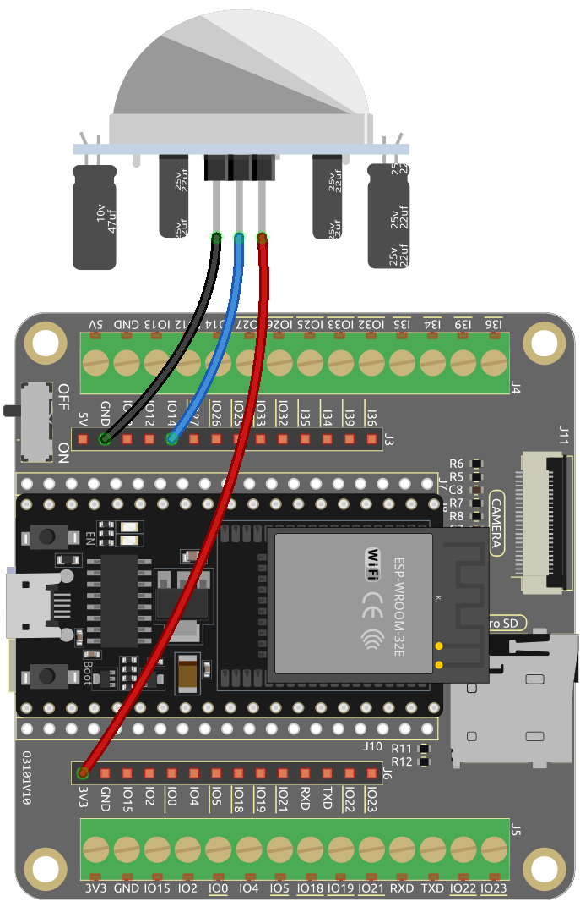

.. note::

    Hallo, willkommen in der SunFounder Raspberry Pi & Arduino & ESP32 Enthusiasten-Gemeinschaft auf Facebook! Vertiefen Sie sich mit anderen Enthusiasten in die Welt von Raspberry Pi, Arduino und ESP32.

    **Warum beitreten?**

    - **Expertenunterstützung**: Lösen Sie Nachverkaufsprobleme und technische Herausforderungen mit Hilfe unserer Gemeinschaft und unseres Teams.
    - **Lernen & Teilen**: Tauschen Sie Tipps und Tutorials aus, um Ihre Fähigkeiten zu verbessern.
    - **Exklusive Vorschauen**: Erhalten Sie frühzeitigen Zugang zu neuen Produktankündigungen und exklusiven Einblicken.
    - **Sonderangebote**: Genießen Sie exklusive Rabatte auf unsere neuesten Produkte.
    - **Festliche Aktionen und Gewinnspiele**: Nehmen Sie an Gewinnspielen und Feiertagsaktionen teil.

    👉 Bereit, mit uns zu erkunden und zu kreieren? Klicken Sie auf [|link_sf_facebook|] und treten Sie heute bei!

.. _iot_intrusion_alert_system:

2.15 Blynk-basiertes Einbruchmeldesystem
==================================================

Dieses Projekt demonstriert ein einfaches Einbruchmeldesystem für Zuhause mithilfe eines PIR-Bewegungssensors (HC-SR501).
Wenn das System über die Blynk-App in den "Abwesenheitsmodus" versetzt wird, überwacht der PIR-Sensor Bewegungen.
Jede erkannte Bewegung löst eine Benachrichtigung in der Blynk-App aus und warnt den Benutzer vor einem möglichen Einbruch.

**Benötigte Komponenten**

In diesem Projekt benötigen wir die folgenden Komponenten.

.. list-table::
    :widths: 30 20
    :header-rows: 1

    *   - KOMPONENTEN-BESCHREIBUNG
        - KAUFLINK

    *   - :ref:`cpn_esp32_wroom_32e`
        - |link_esp32_wroom_32e_buy|
    *   - :ref:`cpn_esp32_camera_extension`
        - \-
    *   - Mehrere Verbindungskabel
        - |link_wires_buy|
    *   - PIR-Bewegungssensor-Modul
        - |link_pir_buy|

1. Schaltungsaufbau
----------------------

2. Blynk-Konfiguration
-----------------------

**2.1 Blynk initialisieren**

1. Gehen Sie zur [Blynk-Plattform](link_blynk) und wählen Sie **Sign Up FREE** oder **Enterprise Solution**.

    .. image:: img/09_blynk_access.png
        :width: 600
        :align: center

2. Geben Sie Ihre E-Mail ein, um den Registrierungsprozess zu starten.

    .. image:: img/09_blynk_sign_in.png
        :align: center

3. Überprüfen Sie Ihre E-Mails und klicken Sie auf den Link **Create Password** in der E-Mail, um Ihr Passwort festzulegen.

    .. image:: img/09_blynk_password.png
        :align: center

4. Nach der Bestätigung beginnt eine **Blynk-Tour**, in der Sie schnell einige der Schlüsselfunktionen von Blynk kennenlernen können.

    .. image:: img/09_blynk_tour.png
        :width: 600
        :align: center

5. Nach Abschluss der Blynk-Tour erscheint ein Fenster, in dem Sie zwischen der Option **Blueprints erkunden** oder **Quick Start** wählen können, um Ihr Gerät schnell zu verbinden. In diesem Fall wählen wir jedoch "Zuerst umsehen".

    .. image:: img/09_blynk_skip.png
        :align: center

**2.2 Vorlage erstellen**

1. Beginnen Sie mit der Erstellung einer Vorlage in Blynk. Folgen Sie den Schritten, um die Vorlage **Intrusion Alert System** einzurichten.

    .. image:: img/09_create_template_1_shadow.png
        :width: 600
        :align: center

2. Benennen Sie Ihre Vorlage, wählen Sie **ESP32** als Hardware, **WiFi** als **Verbindungstyp** und klicken Sie dann auf **Fertig**.

   .. image:: img/09_create_template_2_shadow.png
        :width: 600
        :align: center

3. Betreten Sie die Vorlage, wo Sie mit den nächsten Schritten aufgefordert werden. Klicken Sie auf **Vorlage konfigurieren**, um ein Titelbild hochzuladen, die Beschreibung zu verbessern und mehr. Folgen Sie den verbleibenden drei Schritten, um die Einrichtung abzuschließen.

    .. image:: img/09_blynk_temp_steps.png
        :width: 600
        :align: center

**2.3 Datenströme einrichten**

1. Öffnen Sie die neu erstellte Vorlage und gehen Sie zur Seite zum Einrichten der Datenströme.

   .. image:: img/09_blynk_new_datastream.png
        :width: 600
        :align: center

2. Klicken Sie auf **Neuen Datenstrom**, und wählen Sie im Popup **Virtueller Pin**.

   .. image:: img/09_blynk_datastream_virtual.png
        :width: 600
        :align: center

3. Benennen Sie den **Virtuellen Pin V0** als **AwayMode** und stellen Sie den **DATENTYP** auf **Integer** ein, mit **MIN**- und **MAX**-Werten als **0** und **1**.

   .. image:: img/09_create_template_shadow.png
        :width: 600
        :align: center

4. Erstellen Sie ähnlich einen weiteren **Virtuellen Pin** mit dem Namen **Current Status** und setzen Sie den **DATENTYP** auf **String**.

   .. image:: img/09_datastream_1_shadow.png
        :width: 600
        :align: center

**2.4 Das Web-Dashboard einrichten**

1. Ziehen Sie sowohl das **Schalter-Widget** als auch das **Label-Widget** auf das **Web-Dashboard**.

   .. image:: img/09_web_dashboard_1_shadow.png
        :width: 600
        :align: center

2. Wenn Sie über ein Widget fahren, erscheinen drei Symbole. Verwenden Sie das **Einstellungen**-Symbol, um die Eigenschaften des Widgets zu konfigurieren.

   .. image:: img/09_blynk_dashboard_set.png
        :width: 600
        :align: center

3. Konfigurieren Sie das **Schalter-Widget** so, dass es mit dem Datenstrom **AwayMode(V0)** verknüpft ist. Stellen Sie **ONLABEL** und **OFFLABEL** so ein, dass sie **"weg von zu Hause"** bzw. **"zu Hause"** anzeigen.

   .. image:: img/09_web_dashboard_2_shadow.png
        :width: 600
        :align: center

4. Verknüpfen Sie in den Einstellungen des **Label-Widget** dieses mit dem Datenstrom **Current Status(V1)**.

   .. image:: img/09_web_dashboard_3_shadow.png
        :width: 600
        :align: center

**2.5 Ein Ereignis einrichten**

1. Klicken Sie auf **Ereignisse & Benachrichtigungen** und dann auf **Ereignis erstellen**.

   .. image:: img/09_blynk_event_add.png
        :width: 600
        :align: center
    
2. Benennen Sie das Ereignis und geben Sie dessen Code an. Wählen Sie **Warnung** für den **TYP** und geben Sie eine kurze Beschreibung für die Benachrichtigungs-E-Mail an. Stellen Sie die Benachrichtigungshäufigkeit nach Wunsch ein.

   .. note::
   
      Stellen Sie sicher, dass der **EREIGNISCODE** als ``intrusion_detected`` festgelegt ist. Änderungen hier erfordern entsprechende Codeanpassungen.

   .. image:: img/09_event_1_shadow.png
        :width: 600
        :align: center

3. Gehen Sie zum Abschnitt **Benachrichtigungen**, um Benachrichtigungen zu aktivieren und E-Mail-Einstellungen zu konfigurieren.

   .. image:: img/09_event_2_shadow.png
        :width: 600
        :align: center

4. Definieren Sie unter **Einstellungen**, wie häufig ein Ereignis Benachrichtigungen auslöst und legen Sie Intervalle nach Ihren Vorlieben fest. Denken Sie daran, auf **Erstellen** zu klicken, um Ihre Einstellungen zu speichern.

   .. image:: img/09_event_3_shadow.png
        :width: 600
        :align: center

**2.6 Vorlage speichern**

1. Vergessen Sie nicht, Ihre Änderungen an der Vorlage zu speichern.

   .. image:: img/09_save_template_shadow.png
        :width: 600
        :align: center

**2.7 Ein Gerät erstellen**

1. Es ist Zeit, ein neues Gerät aus der Vorlage zu erstellen.

   .. image:: img/09_blynk_device_new.png
        :width: 600
        :align: center

2. Wählen Sie **Aus Vorlage** aus, um zu beginnen.

   .. image:: img/09_blynk_device_template.png
        :width: 600
        :align: center

3. Wählen Sie die Vorlage **Intrusion Alert System** und klicken Sie auf **Erstellen**.

   .. image:: img/09_blynk_device_template2.png
        :width: 600
        :align: center

4. Notieren Sie sich die **Vorlagen-ID**, den **Gerätenamen** und den **Authentifizierungs-Token** für die Integration Ihres ESP32.

   .. image:: img/09_blynk_device_code.png
        :width: 600
        :align: center

3. Code-Ausführung
-----------------------------

#. Stellen Sie vor dem Ausführen des Codes sicher, dass Sie die ``Blynk``-Bibliothek aus dem **Library Manager** der Arduino IDE installiert haben.

    .. image:: img/09_blynk_add_library.png
        :width: 700
        :align: center

#. Laden Sie diesen Code herunter oder kopieren Sie ihn direkt in die Arduino IDE.

    .. raw:: html

        <iframe src=https://create.arduino.cc/editor/sunfounder01/16bca228-64d7-4519-ac3b-833afecfcc65/preview?embed style="height:510px;width:100%;margin:10px 0" frameborder=0></iframe>

#. Ersetzen Sie die Platzhalter für ``BLYNK_TEMPLATE_ID``, ``BLYNK_TEMPLATE_NAME`` und ``BLYNK_AUTH_TOKEN`` durch Ihre eigenen eindeutigen IDs.

    .. code-block:: arduino
    
        #define BLYNK_TEMPLATE_ID "TMPxxxxxxx"
        #define BLYNK_TEMPLATE_NAME "Intrusion Alert System"
        #define BLYNK_AUTH_TOKEN "xxxxxxxxxxxxx"

#. Geben Sie auch den ``ssid`` und das ``password`` Ihres WLAN-Netzwerks ein.

    .. code-block:: arduino

        char ssid[] = "your_ssid";
        char pass[] = "your_password";

#. Wählen Sie das richtige Board (**ESP32 Dev Module**) und den richtigen Port aus und klicken Sie dann auf die Schaltfläche **Upload**.

#. Öffnen Sie den Seriellen Monitor (stellen Sie die Baudrate auf 115200 ein) und warten Sie auf eine erfolgreiche Verbindungsnachricht.

    .. image:: img/09_blynk_upload_code.png
        :align: center

#. Nach einer erfolgreichen Verbindung wird durch Aktivieren des Schalters in Blynk das Überwachungsmodul des PIR-Moduls gestartet. Wenn eine Bewegung erkannt wird (Zustand 1), erscheint die Nachricht "Somebody here!" und es wird eine Warnung an Ihre E-Mail gesendet.

    .. image:: img/09_blynk_code_alarm.png
        :width: 700
        :align: center

4. Code-Erklärung
-----------------------------

#. **Konfiguration & Bibliotheken**

   Hier setzen Sie die Blynk-Konstanten und -Anmeldeinformationen. Außerdem fügen Sie die notwendigen Bibliotheken für den ESP32 und Blynk ein.

    .. code-block:: arduino

        /* Kommentieren Sie dies aus, um Ausgaben zu deaktivieren und Speicherplatz zu sparen */
        #define BLYNK_PRINT Serial

        #define BLYNK_TEMPLATE_ID "xxxxxxxxxxx"
        #define BLYNK_TEMPLATE_NAME "Intrusion Alert System"
        #define BLYNK_AUTH_TOKEN "xxxxxxxxxxxxxxxxxxxxxxxxxxx"

        #include <WiFi.h>
        #include <WiFiClient.h>
        #include <BlynkSimpleEsp32.h>

#. **WiFi-Einrichtung**

   Geben Sie Ihre WiFi-Zugangsdaten ein.

   .. code-block:: arduino

        char ssid[] = "your_ssid";
        char pass[] = "your_password";

#. **PIR-Sensor-Konfiguration**

   Legen Sie den Pin fest, an dem der PIR-Sensor angeschlossen ist, und initialisieren Sie die Zustandsvariablen.

   .. code-block:: arduino

      const int sensorPin = 14;
      int state = 0;
      int awayHomeMode = 0;
      BlynkTimer timer;

#. **setup() Funktion**

   Diese Funktion initialisiert den PIR-Sensor als Eingang, richtet die serielle Kommunikation ein, verbindet sich mit dem WiFi und konfiguriert Blynk.

   - Wir verwenden ``timer.setInterval(1000L, myTimerEvent)``, um das Zeitintervall im ``setup()`` festzulegen. Hier wird die Funktion ``myTimerEvent()`` alle **1000ms** ausgeführt. Sie können den ersten Parameter von ``timer.setInterval(1000L, myTimerEvent)`` ändern, um das Intervall zwischen den Ausführungen von ``myTimerEvent`` anzupassen.

   .. raw:: html
    
      

   .. code-block:: arduino

        void setup() {

            pinMode(sensorPin, INPUT);  // Setzen Sie den PIR-Sensor-Pin als Eingang
            Serial.begin(115200);       // Starten Sie die serielle Kommunikation mit 115200 Baud für das Debugging
            
            // Konfigurieren Sie Blynk und verbinden Sie sich mit dem WiFi
            Blynk.begin(BLYNK_AUTH_TOKEN, ssid, pass);
            
            timer.setInterval(1000L, myTimerEvent);  // Richten Sie eine Funktion ein, die jede Sekunde aufgerufen wird
        }

#. **loop() Funktion**

   Die loop-Funktion führt kontinuierlich die Blynk- und die Blynk-Timer-Funktionen aus.

   .. code-block:: arduino

        void loop() {
           Blynk.run();
           timer.run();
        }

#. **Interaktion mit der Blynk-App**

   Diese Funktionen werden aufgerufen, wenn das Gerät eine Verbindung zu Blynk herstellt und wenn sich der Zustand des virtuellen Pins V0 in der Blynk-App ändert.

   - Jedes Mal, wenn das Gerät eine Verbindung zum Blynk-Server herstellt oder aufgrund schlechter Netzwerkbedingungen erneut verbindet, wird die Funktion ``BLYNK_CONNECTED()`` aufgerufen. Der Befehl ``Blynk.syncVirtual()`` fordert den Wert eines virtuellen Pins an. Der angegebene virtuelle Pin führt den Aufruf ``BLYNK_WRITE()`` aus. 

   - Wann immer sich der Wert eines virtuellen Pins auf dem Blynk-Server ändert, wird ``BLYNK_WRITE()`` ausgelöst.

   .. raw:: html
    
      

   .. code-block:: arduino
      
        // Diese Funktion wird jedes Mal aufgerufen, wenn das Gerät eine Verbindung zu Blynk.Cloud herstellt
        BLYNK_CONNECTED() {
            Blynk.syncVirtual(V0);
        }
      
        // Diese Funktion wird jedes Mal aufgerufen, wenn sich der Zustand des virtuellen Pins 0 ändert
        BLYNK_WRITE(V0) {
            awayHomeMode = param.asInt();
            // zusätzliche Logik
        }

#. **Datenverarbeitung**

   Jede Sekunde ruft die Funktion ``myTimerEvent()`` die Funktion ``sendData()`` auf. Wenn der Abwesenheitsmodus in Blynk aktiviert ist, überprüft er den PIR-Sensor und sendet eine Benachrichtigung an Blynk, wenn eine Bewegung erkannt wird.

   - Wir verwenden ``Blynk.virtualWrite(V1, "Somebody in your house! Please check!");``, um den Text eines Labels zu ändern.

   - Verwenden Sie ``Blynk.logEvent("intrusion_detected");``, um ein Ereignis in Blynk zu protokollieren.

   .. raw:: html
    
      

   .. code-block:: arduino

        void myTimerEvent() {
           sendData();
        }

        void sendData() {
           if (awayHomeMode == 1) {
              state = digitalRead(sensorPin);  // Lesen Sie den Zustand des PIR-Sensors

              Serial.print("state:");
              Serial.println(state);

              // Wenn der Sensor eine Bewegung erkennt, senden Sie eine Warnung an die Blynk-App
              if (state == HIGH) {
                Serial.println("Somebody here!");
                Blynk.virtualWrite(V1, "Somebody in your house! Please check!");
                Blynk.logEvent("intrusion_detected");
              }
           }
        }

**Referenzen**

- |link_blynk_doc|
- |link_blynk_quickstart| 
- |link_blynk_virtualWrite|
- |link_blynk_logEvent|
- |link_blynk_timer_intro|
- |link_blynk_syncing| 
- |link_blynk_write|
