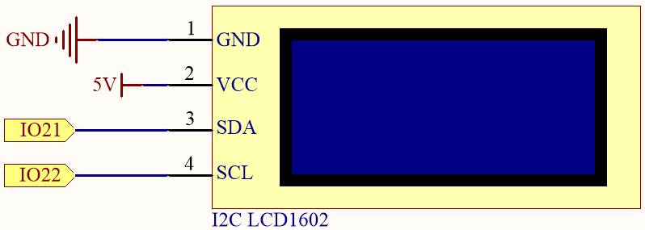
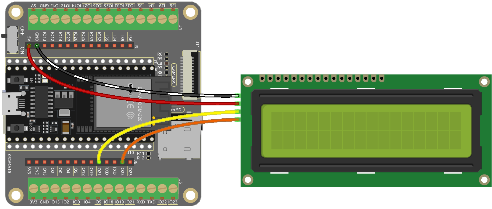

.. _ar_lcd1602:

2.5 I2C Interface
==========================

In this lesson, we'll delve into the capabilities of the I2C interface, a cornerstone for communication between microcontrollers and various peripherals. Our focus will be on utilizing the ESP32’s I2C interface to drive an LCD1602 module for character display.You will learn how to initialize the LCD module, configure display parameters, and send text data to be shown on the screen. Whether you aim to display custom messages, sensor readings, or interactive menus, mastering the LCD1602 will expand your ability to create informative and interactive displays.

**Available Pins**

Here is a list of available pins on the ESP32 board for this project.

.. list-table::
    :widths: 5 15
    :header-rows: 1

    *   - Available Pins
        - Usage Description

    *   - IO21
        - SDA
    *   - IO22
        - SCL

**Required Components**

In this project, we need the following components. 

.. list-table::
    :widths: 30 20
    :header-rows: 1

    *   - COMPONENT INTRODUCTION
        - PURCHASE LINK

    *   - :ref:`cpn_esp32_wroom_32e`
        - |link_esp32_wroom_32e_buy|
    *   - :ref:`cpn_esp32_camera_extension`
        - \-
    *   - Several Jump Wires
        - |link_wires_buy|
    *   - I2C LCD1602
        - |link_i2clcd1602_buy|

    
**Schematic**

**Wiring**

**Code**

#. Download this code or copy this code to the Arduino IDE directly.
    
.. note::
    
    * :ref:`unknown_com_port`
    * The ``LiquidCrystal I2C`` library is used here, you can install it from the **Library Manager**.

        .. image:: img/lcd_lib.png

.. raw:: html

    <iframe src=https://create.arduino.cc/editor/sunfounder01/31e33e53-67b2-4e29-b78b-f647fd45fb0b/preview?embed style="height:510px;width:100%;margin:10px 0" frameborder=0></iframe>

When this program is uploaded, the I2C LCD1602 will display the welcome message, "Hello, Sunfounder!", for 3 seconds. After that, the screen will show a "COUNT:" label and the count value, which increments every second.

.. note:: 

    If the code and wiring are correct, but the LCD still fails to display any content, you can adjust the potentiometer on the back to increase the contrast.

**How it works?**

By calling the library ``LiquidCrystal_I2C.h``, you can easily drive the LCD. 

.. code-block:: arduino

    #include <LiquidCrystal_I2C.h>

Library Functions：

* Creates a new instance of the ``LiquidCrystal_I2C`` class that represents a particular LCD attached to your Arduino board.

    .. code-block:: arduino

        LiquidCrystal_I2C(uint8_t lcd_Addr,uint8_t lcd_cols,uint8_t lcd_rows)

    * ``lcd_AddR``: The address of the LCD defaults to 0x27.
    * ``lcd_cols``: The LCD1602 has 16 columns.
    * ``lcd_rows``: The LCD1602 has 2 rows.

* Initialize the lcd.

    .. code-block:: arduino

        void init()

* Turn the (optional) backlight on.

    .. code-block:: arduino

        void backlight()

* Turn the (optional) backlight off.

    .. code-block:: arduino

        void nobacklight()

* Turn the LCD display on.

    .. code-block:: arduino

        void display()

* Turn the LCD display off quickly.

    .. code-block:: arduino

        void nodisplay()

* Clear display, set cursor position to zero.

    .. code-block:: arduino

        void clear()

* Set the cursor position to col,row.

    .. code-block:: arduino

        void setCursor(uint8_t col,uint8_t row)

* Prints text to the LCD.

    .. code-block:: arduino

        void print(data,BASE)

    * ``data``: The data to print (char, byte, int, long, or string).
    * ``BASE (optional)``: The base in which to print numbers.

        * ``BIN`` for binary (base 2)
        * ``DEC`` for decimal (base 10)
        * ``OCT`` for octal (base 8)
        * ``HEX`` for hexadecimal (base 16).
