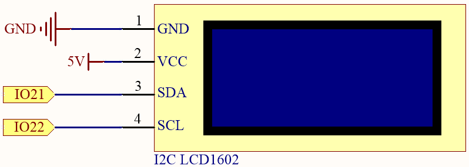
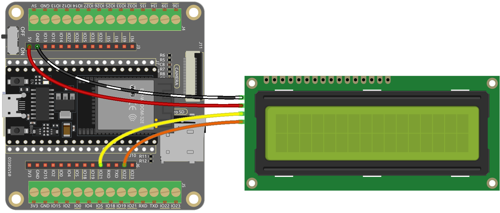

 .. note::

    Hallo, willkommen in der SunFounder Raspberry Pi & Arduino & ESP32 Enthusiasten-Gemeinschaft auf Facebook! Vertiefen Sie sich mit anderen Enthusiasten in die Welt von Raspberry Pi, Arduino und ESP32.

    **Warum beitreten?**

    - **Expertenunterstützung**: Lösen Sie Nachverkaufsprobleme und technische Herausforderungen mit Hilfe unserer Gemeinschaft und unseres Teams.
    - **Lernen & Teilen**: Tauschen Sie Tipps und Tutorials aus, um Ihre Fähigkeiten zu verbessern.
    - **Exklusive Vorschauen**: Erhalten Sie frühzeitigen Zugang zu neuen Produktankündigungen und exklusiven Einblicken.
    - **Sonderangebote**: Genießen Sie exklusive Rabatte auf unsere neuesten Produkte.
    - **Festliche Aktionen und Gewinnspiele**: Nehmen Sie an Gewinnspielen und Feiertagsaktionen teil.

    👉 Bereit, mit uns zu erkunden und zu kreieren? Klicken Sie auf [|link_sf_facebook|] und treten Sie heute bei!

.. _ar_lcd1602:

2.5 I2C-Schnittstelle
==========================

In dieser Lektion werden wir die Fähigkeiten der I2C-Schnittstelle erkunden, eine zentrale Technologie für die Kommunikation zwischen Mikrocontrollern und verschiedenen Peripheriegeräten. Unser Fokus liegt darauf, die I2C-Schnittstelle des ESP32 zu nutzen, um ein LCD1602-Modul zur Zeichenanzeige anzusteuern. Sie lernen, wie Sie das LCD-Modul initialisieren, Anzeigeparameter konfigurieren und Textdaten zur Anzeige auf dem Bildschirm senden. Ob Sie benutzerdefinierte Nachrichten, Sensordaten oder interaktive Menüs anzeigen möchten, die Beherrschung des LCD1602 wird Ihre Fähigkeit erweitern, informative und interaktive Anzeigen zu erstellen.

**Verfügbare Pins**

Hier ist eine Liste der für dieses Projekt verfügbaren Pins auf dem ESP32-Board.

.. list-table::
    :widths: 5 15
    :header-rows: 1

    *   - Verfügbare Pins
        - Verwendungsbeschreibung

    *   - IO21
        - SDA
    *   - IO22
        - SCL

**Benötigte Komponenten**

In diesem Projekt benötigen wir die folgenden Komponenten.

.. list-table::
    :widths: 30 20
    :header-rows: 1

    *   - KOMPONENTEN-BESCHREIBUNG
        - KAUFLINK

    *   - :ref:`cpn_esp32_wroom_32e`
        - |link_esp32_wroom_32e_buy|
    *   - :ref:`cpn_esp32_camera_extension`
        - \-
    *   - Mehrere Verbindungskabel
        - |link_wires_buy|
    *   - I2C LCD1602
        - |link_i2clcd1602_buy|

**Schaltplan**

**Verdrahtung**

**Code**

#. |link_download_this_code| herunter oder kopieren Sie ihn direkt in die Arduino IDE.

   .. code-block:: arduino

        #include <Wire.h>
        #include <LiquidCrystal_I2C.h>

        //SDA->21,SCL->22
        LiquidCrystal_I2C lcd(0x27,16,2);  // set the LCD address to 0x27 for a 16 chars and 2 line display

        int count = 0;

        void setup()
        {
          lcd.init();// initialize the lcd
          lcd.backlight(); // Turns on the LCD backlight.
          lcd.print("Hello, world!");   // Print a message to the LCD.
          delay(3000);
        }

        void loop()
        {
          lcd.clear();
          lcd.setCursor(0, 0); // Sets the cursor position to the first row and first column (0, 0).
          lcd.print("COUNT: ");
          lcd.print(count); // Prints the current value of the count variable.
          delay(1000);
          count++; // Increments the counter by 1.
        }

Wenn dieses Programm hochgeladen ist, zeigt das I2C LCD1602 für 3 Sekunden die Willkommensnachricht "Hello, Sunfounder!" an. Danach zeigt der Bildschirm das Label "COUNT:" und den Zählwert, der jede Sekunde um eins erhöht wird.

.. note:: 

    Wenn der Code und die Verdrahtung korrekt sind, das LCD jedoch keine Inhalte anzeigt, können Sie das Potentiometer auf der Rückseite einstellen, um den Kontrast zu erhöhen.

**Wie funktioniert es?**

Durch den Aufruf der Bibliothek ``LiquidCrystal_I2C.h`` können Sie das LCD problemlos ansteuern.

.. code-block:: arduino

    #include <LiquidCrystal_I2C.h>

Bibliotheksfunktionen：

* Erstellt eine neue Instanz der Klasse ``LiquidCrystal_I2C``, die ein bestimmtes LCD darstellt, das an Ihr Arduino-Board angeschlossen ist.

    .. code-block:: arduino

        LiquidCrystal_I2C(uint8_t lcd_Addr,uint8_t lcd_cols,uint8_t lcd_rows)

    * ``lcd_Addr``: Die Adresse des LCDs, standardmäßig 0x27.
    * ``lcd_cols``: Das LCD1602 hat 16 Spalten.
    * ``lcd_rows``: Das LCD1602 hat 2 Zeilen.

* Initialisieren Sie das LCD.

    .. code-block:: arduino

        void init()

* Schalten Sie die (optionale) Hintergrundbeleuchtung ein.

    .. code-block:: arduino

        void backlight()

* Schalten Sie die (optionale) Hintergrundbeleuchtung aus.

    .. code-block:: arduino

        void nobacklight()

* Schalten Sie die LCD-Anzeige ein.

    .. code-block:: arduino

        void display()

* Schalten Sie die LCD-Anzeige schnell aus.

    .. code-block:: arduino

        void nodisplay()

* Anzeige löschen, Cursorposition auf null setzen.

    .. code-block:: arduino

        void clear()

* Setzen Sie die Cursorposition auf Spalte und Zeile.

    .. code-block:: arduino

        void setCursor(uint8_t col,uint8_t row)

* Text auf dem LCD anzeigen.

    .. code-block:: arduino

        void print(data,BASE)

    * ``data``: Die anzuzeigenden Daten (char, byte, int, long oder string).
    * ``BASE (optional)``: Die Basis, in der Zahlen angezeigt werden sollen.

        * ``BIN`` für binär (Basis 2)
        * ``DEC`` für dezimal (Basis 10)
        * ``OCT`` für oktal (Basis 8)
        * ``HEX`` für hexadezimal (Basis 16).
