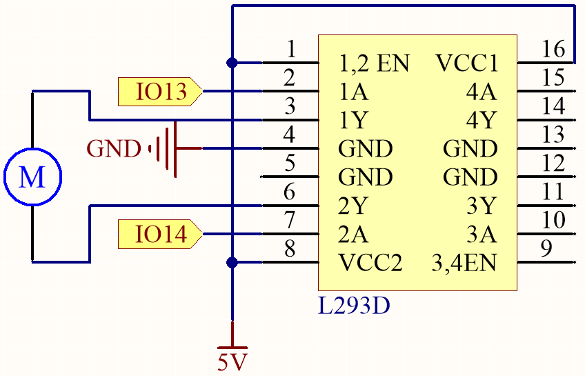
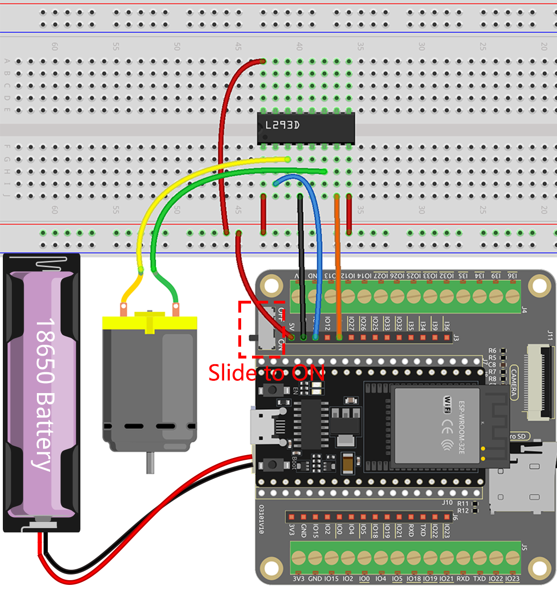

 .. note::

    Hallo, willkommen in der SunFounder Raspberry Pi & Arduino & ESP32 Enthusiasten-Gemeinschaft auf Facebook! Vertiefen Sie sich mit anderen Enthusiasten in die Welt von Raspberry Pi, Arduino und ESP32.

    **Warum beitreten?**

    - **Expertenunterstützung**: Lösen Sie Nachverkaufsprobleme und technische Herausforderungen mit Hilfe unserer Gemeinschaft und unseres Teams.
    - **Lernen & Teilen**: Tauschen Sie Tipps und Tutorials aus, um Ihre Fähigkeiten zu verbessern.
    - **Exklusive Vorschauen**: Erhalten Sie frühzeitigen Zugang zu neuen Produktankündigungen und exklusiven Einblicken.
    - **Sonderangebote**: Genießen Sie exklusive Rabatte auf unsere neuesten Produkte.
    - **Festliche Aktionen und Gewinnspiele**: Nehmen Sie an Gewinnspielen und Feiertagsaktionen teil.

    👉 Bereit, mit uns zu erkunden und zu kreieren? Klicken Sie auf [|link_sf_facebook|] und treten Sie heute bei!

.. _ar_motor:

2.6 Motoransteuerung
===========================

In diesem spannenden Projekt werden wir erkunden, wie man einen Motor mit dem L293D ansteuert.

Der L293D ist ein vielseitiger integrierter Schaltkreis (IC), der häufig zur Motorsteuerung in Elektronik- und Robotikprojekten verwendet wird. Er kann zwei Motoren sowohl in Vorwärts- als auch in Rückwärtsrichtung antreiben und ist daher eine beliebte Wahl für Anwendungen, die eine präzise Motorsteuerung erfordern.

Am Ende dieses fesselnden Projekts werden Sie ein umfassendes Verständnis dafür gewonnen haben, wie digitale Signale und PWM-Signale effektiv zur Motorsteuerung genutzt werden können. Dieses wertvolle Wissen wird eine solide Grundlage für Ihre zukünftigen Unternehmungen in der Robotik und Mechatronik bilden. Machen Sie sich bereit, in die aufregende Welt der Motorsteuerung mit dem L293D einzutauchen!

**Benötigte Komponenten**

In diesem Projekt benötigen wir die folgenden Komponenten.

.. list-table::
    :widths: 30 20
    :header-rows: 1

    *   - KOMPONENTEN-BESCHREIBUNG
        - KAUFLINK

    *   - :ref:`cpn_esp32_wroom_32e`
        - |link_esp32_wroom_32e_buy|
    *   - :ref:`cpn_esp32_camera_extension`
        - \-
    *   - Steckbrett
        - |link_breadboard_buy|
    *   - Mehrere Verbindungskabel
        - |link_wires_buy|
    *   - Gleichstrommotor
        - |link_motor_buy|
    *   - L293D Motortreiber
        - \-

**Verfügbare Pins**

Hier ist eine Liste der für dieses Projekt verfügbaren Pins auf dem ESP32-Board.

.. list-table::
    :widths: 5 20 

    * - Verfügbare Pins
      - IO13, IO14, IO27, IO26, IO25, IO33, IO32, IO15, IO2, IO0, IO4, IO5, IO18, IO19, IO21, IO22, IO23

**Schaltplan**

    
**Verdrahtung**

.. note:: 

  Da der Motor einen relativ hohen Strom benötigt, ist es notwendig, zuerst die Batterie einzusetzen und dann den Schalter auf dem Erweiterungsboard in die ON-Position zu schieben, um die Stromversorgung der Batterie zu aktivieren. 

**Code**

#. Laden Sie diesen Code herunter oder kopieren Sie ihn direkt in die Arduino IDE.

.. note::

    * :ref:`unknown_com_port`
    
    
.. raw:: html
    
  <iframe src=https://create.arduino.cc/editor/sunfounder01/13364fc5-5094-4a84-90ce-07a5f85556dc/preview?embed style="height:510px;width:100%;margin:10px 0" frameborder=0></iframe>

Sobald der Code erfolgreich hochgeladen wurde, werden Sie beobachten, dass sich der Motor eine Sekunde lang im Uhrzeigersinn dreht, dann eine Sekunde lang gegen den Uhrzeigersinn und anschließend eine zwei Sekunden lange Pause einlegt. Diese Abfolge von Aktionen wird in einer Endlosschleife fortgesetzt.

**Mehr erfahren**

Zusätzlich dazu, den Motor einfach im Uhrzeigersinn und gegen den Uhrzeigersinn drehen zu lassen, können Sie auch die Drehgeschwindigkeit des Motors steuern, indem Sie Pulsweitenmodulation (PWM) am Steuerpin verwenden, wie unten gezeigt.

.. note::

    * Öffnen Sie die Datei ``4.1_motor_pwm.ino`` unter dem Pfad ``esp32-starter-kit-main\c\codes\4.1_motor_pwm``.
    * Nachdem Sie das Board (ESP32 Dev Module) und den entsprechenden Port ausgewählt haben, klicken Sie auf die Schaltfläche **Upload**.
    * :ref:`unknown_com_port`
    
    
.. raw:: html

  <iframe src=https://create.arduino.cc/editor/sunfounder01/32c262fd-9975-4137-9973-8b62d7240fee/preview?embed style="height:510px;width:100%;margin:10px 0" frameborder=0></iframe>

Der vorherige Code setzt die beiden Pins des Motors direkt auf hohe oder niedrige Spannungspegel, um die Drehung und das Anhalten des Motors zu steuern.

Hier verwenden wir die |link_ledc| (LED-Steuerung) Peripherie, um PWM-Signale zu erzeugen, um die Drehgeschwindigkeit des Motors zu steuern. Durch zwei ``for``-Schleifen wird das Tastverhältnis des Kanals A von 0 auf 255 erhöht oder verringert, während Kanal B auf 0 bleibt.

Auf diese Weise können Sie beobachten, wie der Motor seine Geschwindigkeit allmählich auf 255 erhöht und dann wieder auf 0 verringert, und dies in einer Endlosschleife.

Wenn Sie möchten, dass sich der Motor in die entgegengesetzte Richtung dreht, tauschen Sie einfach die Werte von Kanal A und Kanal B.
