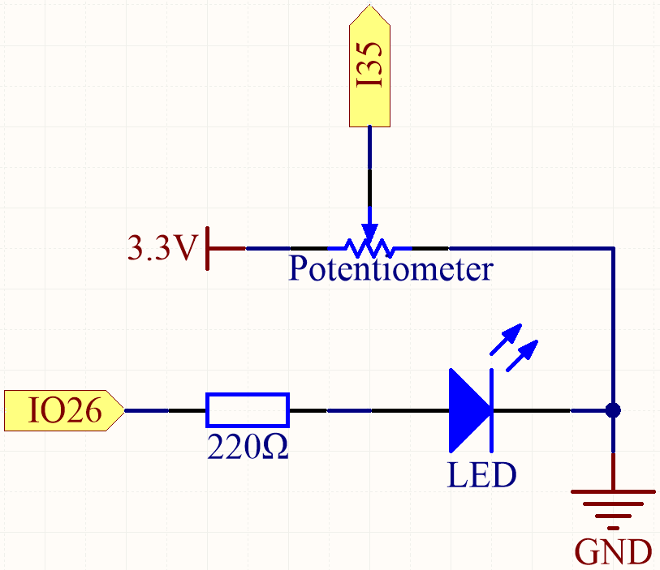
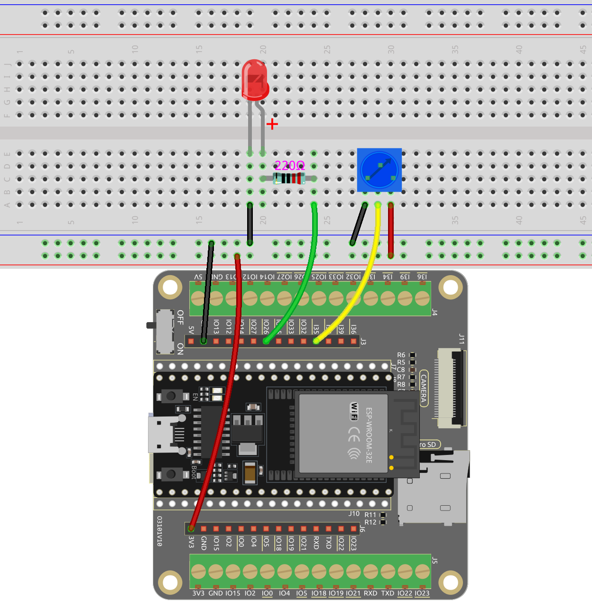

 .. note::

    Hallo, willkommen in der SunFounder Raspberry Pi & Arduino & ESP32 Enthusiasten-Gemeinschaft auf Facebook! Vertiefen Sie sich mit anderen Enthusiasten in die Welt von Raspberry Pi, Arduino und ESP32.

    **Warum beitreten?**

    - **Expertenunterstützung**: Lösen Sie Nachverkaufsprobleme und technische Herausforderungen mit Hilfe unserer Gemeinschaft und unseres Teams.
    - **Lernen & Teilen**: Tauschen Sie Tipps und Tutorials aus, um Ihre Fähigkeiten zu verbessern.
    - **Exklusive Vorschauen**: Erhalten Sie frühzeitigen Zugang zu neuen Produktankündigungen und exklusiven Einblicken.
    - **Sonderangebote**: Genießen Sie exklusive Rabatte auf unsere neuesten Produkte.
    - **Festliche Aktionen und Gewinnspiele**: Nehmen Sie an Gewinnspielen und Feiertagsaktionen teil.

    👉 Bereit, mit uns zu erkunden und zu kreieren? Klicken Sie auf [|link_sf_facebook|] und treten Sie heute bei!

.. _ar_potentiometer:

2.4 Analogeingang
==========================

In dieser Lektion untersuchen wir die Verwendung eines Potentiometers als Analogeingabegerät zur Anpassung der Helligkeit einer LED. Durch einfaches Drehen des Potentiometerknopfes können Sie die Lichtintensität der LED variieren, ähnlich wie Sie die Helligkeit einer Schreibtischlampe einstellen würden. Dieses einfache Setup zeigt den direkten Einfluss von Analogeingaben auf reale Anwendungen und bietet ein intuitives Verständnis dafür, wie Änderungen der Eingaben elektronische Komponenten steuern können.

**Verfügbare Pins**

* **Verfügbare Pins**

    Hier ist eine Liste der verfügbaren Pins auf dem ESP32-Board für dieses Projekt.

    .. list-table::
        :widths: 5 15

        *   - Verfügbare Pins
            - IO14, IO25, I35, I34, I39, I36

* **Strapping Pins**

    Die folgenden Pins sind Strapping Pins, die den Startvorgang des ESP32 beim Einschalten oder Zurücksetzen beeinflussen. Sobald der ESP32 jedoch erfolgreich hochgefahren ist, können sie als normale Pins verwendet werden.

    .. list-table::
        :widths: 5 15

        *   - Strapping Pins
            - IO0, IO12

**Benötigte Komponenten**

In diesem Projekt benötigen wir die folgenden Komponenten.

.. list-table::
    :widths: 30 20
    :header-rows: 1

    *   - KOMPONENTEN-BESCHREIBUNG
        - KAUFLINK

    *   - :ref:`cpn_esp32_wroom_32e`
        - |link_esp32_wroom_32e_buy|
    *   - :ref:`cpn_esp32_camera_extension`
        - \-
    *   - Steckbrett
        - |link_breadboard_buy|
    *   - Mehrere Verbindungskabel
        - |link_wires_buy|
    *   - Widerstand
        - |link_resistor_buy|
    *   - LED
        - |link_led_buy|
    *   - Potentiometer
        - |link_potentiometer_buy|

**Schaltplan**

Wenn Sie das Potentiometer drehen, ändert sich der Wert von I35. Durch Programmierung können Sie den Wert von I35 verwenden, um die Helligkeit der LED zu steuern. Daher ändert sich die Helligkeit der LED entsprechend, wenn Sie das Potentiometer drehen.

**Verdrahtung**

**Code**

Laden Sie diesen Code herunter oder kopieren Sie ihn direkt in die Arduino IDE.

.. note::

    * :ref:`unknown_com_port`
   
.. raw:: html
     
    <iframe src=https://create.arduino.cc/editor/sunfounder01/aadce2e7-fd5d-4608-a557-f1e4d07ba795/preview?embed style="height:510px;width:100%;margin:10px 0" frameborder=0></iframe>

Nachdem der Code erfolgreich hochgeladen wurde, drehen Sie das Potentiometer und sehen, wie sich die Helligkeit der LED entsprechend ändert. Gleichzeitig können Sie die Analog- und Spannungswerte des Potentiometers im seriellen Monitor sehen.

**Wie funktioniert das?**

#. Definieren Sie Konstanten für Pin-Verbindungen und PWM-Einstellungen.

    .. code-block:: arduino

        const int potPin = 35; // Potentiometer an GPIO35 angeschlossen
        const int ledPin = 26; // LED an GPIO26 angeschlossen

        // PWM-Einstellungen
        const int freq = 5000; // PWM-Frequenz
        const int resolution = 12; // PWM-Auflösung (Bits)
        const int channel = 0; // PWM-Kanal

    Hier ist die PWM-Auflösung auf 12 Bit eingestellt und der Bereich liegt zwischen 0 und 4095.

#. Konfigurieren Sie das System in der ``setup()``-Funktion.

    .. code-block:: arduino

        void setup() {
            Serial.begin(115200);

            // PWM konfigurieren
            ledcAttach(ledPin, freq, resolution);
        }

    * In der ``setup()``-Funktion wird die serielle Kommunikation mit einer Baudrate von 115200 gestartet.
    * Die Funktion ``ledcAttach()`` wird aufgerufen, um den angegebenen LED-Pin mit der angegebenen Frequenz und Auflösung einzurichten.

#. Hauptschleife (wird wiederholt ausgeführt) in der ``loop()``-Funktion.

    .. code-block:: arduino

        void loop() {

            int potValue = analogRead(potPin); // den Wert des Potentiometers lesen
            uint32_t voltage_mV = analogReadMilliVolts(potPin); // die Spannung in Millivolt lesen
            
            ledcWrite(channel, potValue);
            
            Serial.print("Potentiometer Value: ");
            Serial.print(potValue);
            Serial.print(", Voltage: ");
            Serial.print(voltage_mV / 1000.0); // Convert millivolts to volts
            Serial.println(" V");
            
            delay(100);
        }

    * ``uint32_t analogReadMilliVolts(uint8_t pin);``: Diese Funktion wird verwendet, um den ADC-Wert für einen gegebenen Pin/ADC-Kanal in Millivolt zu erhalten.

        * ``pin``: GPIO-Pin zum Lesen des Analogwerts.

    Der Potentiometerwert wird direkt als PWM-Tastverhältnis zur Steuerung der LED-Helligkeit über die Funktion ``ledcWrite()`` verwendet, da der Wertebereich ebenfalls von 0 bis 4095 reicht.
