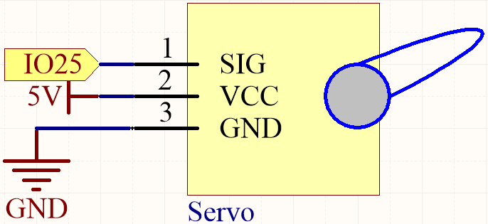
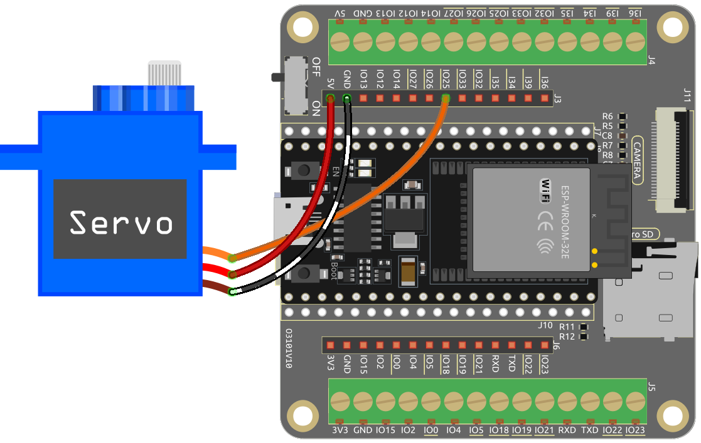

 .. note::

    Hallo und herzlich willkommen in der SunFounder Raspberry Pi & Arduino & ESP32 Enthusiasts Community auf Facebook! Tauchen Sie gemeinsam mit anderen Enthusiasten tiefer in die Welt von Raspberry Pi, Arduino und ESP32 ein.

    **Warum beitreten?**

    - **Expertenunterstützung**: Lösen Sie Probleme nach dem Kauf und technische Herausforderungen mit Hilfe unserer Community und unseres Teams.
    - **Lernen & Teilen**: Tauschen Sie Tipps und Tutorials aus, um Ihre Fähigkeiten zu verbessern.
    - **Exklusive Vorschauen**: Erhalten Sie frühzeitigen Zugang zu neuen Produktankündigungen und Vorschauen.
    - **Exklusive Rabatte**: Genießen Sie exklusive Rabatte auf unsere neuesten Produkte.
    - **Festliche Aktionen und Verlosungen**: Nehmen Sie an Verlosungen und festlichen Aktionen teil.

    👉 Bereit, mit uns zu erkunden und zu kreieren? Klicken Sie [|link_sf_facebook|] und treten Sie noch heute bei!

.. _ar_servo:

2.7 Steuerung eines Servos
===============================
Ein Servo ist ein positionsbasiertes Gerät, das für seine Fähigkeit bekannt ist, bestimmte Winkel zu halten und präzise Drehungen durchzuführen. Dies macht es sehr begehrt für Steuerungssysteme, die konstante Winkelanpassungen erfordern. Kein Wunder, dass Servos in hochwertigen ferngesteuerten Spielzeugen weit verbreitet sind, von Flugzeugmodellen über U-Boot-Replikate bis hin zu ausgeklügelten ferngesteuerten Robotern.

In diesem spannenden Projekt werden wir uns der Herausforderung stellen, den Servo auf eine einzigartige Weise zu manipulieren – indem wir ihn schwingen lassen! Dieses Projekt bietet eine hervorragende Gelegenheit, tiefer in die Dynamik von Servos einzutauchen, Ihre Fähigkeiten in präzisen Steuerungssystemen zu schärfen und ein tieferes Verständnis ihrer Funktionsweise zu erlangen.

Sind Sie bereit, den Servo zum Tanzen zu bringen? Lassen Sie uns dieses aufregende Abenteuer beginnen!

**Benötigte Komponenten**

In diesem Projekt benötigen wir die folgenden Komponenten. 

.. list-table::
    :widths: 30 20
    :header-rows: 1

    *   - KOMPONENTEN-EINFÜHRUNG
        - KAUFLINK

    *   - :ref:`cpn_esp32_wroom_32e`
        - |link_esp32_wroom_32e_buy|
    *   - :ref:`cpn_esp32_camera_extension`
        - \-
    *   - Mehrere Steckbrücken
        - |link_wires_buy|
    *   - Servo
        - |link_servo_buy|

**Verfügbare Pins**

Hier ist eine Liste der verfügbaren Pins auf dem ESP32-Board für dieses Projekt.

.. list-table::
    :widths: 5 20 

    * - Verfügbare Pins
      - IO13, IO12, IO14, IO27, IO26, IO25, IO33, IO32, IO15, IO2, IO0, IO4, IO5, IO18, IO19, IO21, IO22, IO23

**Schaltplan**

**Verkabelung**

* Das orangefarbene Kabel ist das Signalkabel und wird an IO25 angeschlossen.
* Das rote Kabel ist VCC und wird an 5V angeschlossen.
* Das braune Kabel ist GND und wird an GND angeschlossen.

**Code**

Laden Sie diesen Code herunter oder kopieren Sie ihn direkt in die Arduino IDE.

.. note::

    * :ref:`unknown_com_port`
    * Die ``ESP32Servo``-Bibliothek wird hier verwendet, Sie können sie über den **Bibliotheks-Manager** installieren.

        .. image:: img/servo_lib.png

.. raw:: html

    <iframe src=https://create.arduino.cc/editor/sunfounder01/34c7969e-fee3-413c-9fe7-9d38ca6fb906/preview?embed style="height:510px;width:100%;margin:10px 0" frameborder=0></iframe>

Sobald Sie den Code hochgeladen haben, können Sie sehen, wie sich der Servoarm im Bereich von 0° bis 180° dreht.

**Wie funktioniert das?**

#. Einbinden der |link_esp32servo| Bibliothek: Diese Zeile importiert die ESP32Servo-Bibliothek, die zur Steuerung des Servomotors benötigt wird.

    .. code-block:: arduino

        #include <ESP32Servo.h>

#. Definition des Servos und des Pins, an den er angeschlossen ist: In diesem Abschnitt wird ein Servo-Objekt (``myServo``) und eine konstante Ganzzahl (``servoPin``) deklariert, die den Pin darstellt, an den der Servomotor angeschlossen ist (Pin 25).

    .. code-block:: arduino

        // Definiere den Servo und den Pin, an den er angeschlossen ist
        Servo myServo;
        const int servoPin = 25;

#. Definition der minimalen und maximalen Impulsbreiten für den Servo: In diesem Abschnitt werden die minimalen und maximalen Impulsbreiten für den Servomotor festgelegt (0,5 ms bzw. 2,5 ms).

    .. code-block:: arduino

        // Definiere die minimale und maximale Impulsbreite für den Servo
        const int minPulseWidth = 500; // 0,5 ms
        const int maxPulseWidth = 2500; // 2,5 ms

#. Die ``setup``-Funktion initialisiert den Servomotor, indem sie ihn an den angegebenen Pin anschließt und dessen Impulsbreitenbereich festlegt. Außerdem wird die PWM-Frequenz für den Servo auf den Standardwert von 50 Hz eingestellt.

    .. code-block:: arduino

        void setup() {
            // Befestige den Servo am angegebenen Pin und lege den Impulsbreitenbereich fest
            myServo.attach(servoPin, minPulseWidth, maxPulseWidth);

            // Setze die PWM-Frequenz für den Servo
            myServo.setPeriodHertz(50); // Standard 50Hz Servo
        }
    
    * ``attach (int pin, int min, int max)``: Diese Funktion befestigt den Servomotor am angegebenen GPIO-Pin und legt die minimalen und maximalen Impulsbreiten für den Servo fest.

        * ``pin``: Die Nummer des GPIO-Pins, an den der Servo angeschlossen ist. 
        * Die ``min`` und ``max``: die minimalen und maximalen Impulsbreiten in Mikrosekunden. Diese Werte definieren den Bewegungsbereich des Servomotors.

    * ``setPeriodHertz(int hertz)``: Diese Funktion setzt die PWM-Frequenz für den Servomotor in Hertz.

        * ``hertz``: Die gewünschte PWM-Frequenz in Hertz. Die Standard-PWM-Frequenz für Servos beträgt 50 Hz, was für die meisten Anwendungen geeignet ist. 

#. Die ``loop``-Funktion ist der Hauptteil des Codes, der kontinuierlich läuft. Sie dreht den Servomotor von 0 bis 180 Grad und dann wieder zurück auf 0 Grad. Dies geschieht, indem der Winkel auf die entsprechende Impulsbreite abgebildet und der Servomotor mit dem neuen Impulsbreitenwert aktualisiert wird.

    .. code-block:: arduino

        void loop() {
            // Drehe den Servo von 0 auf 180 Grad
            for (int angle = 0; angle <= 180; angle++) {
                int pulseWidth = map(angle, 0, 180, minPulseWidth, maxPulseWidth);
                myServo.writeMicroseconds(pulseWidth);
                delay(15);
            }
    
            // Drehe den Servo von 180 auf 0 Grad
            for (int angle = 180; angle >= 0; angle--) {
                int pulseWidth = map(angle, 0, 180, minPulseWidth, maxPulseWidth);
                myServo.writeMicroseconds(pulseWidth);
                delay(15);
            }
        }

    * ``writeMicroseconds(int value)``: Diese Funktion setzt die Impulsbreite des Servomotors in Mikrosekunden.

        * ``value``: Die gewünschte Impulsbreite in Mikrosekunden.

        Die Funktion ``writeMicroseconds(int value)`` nimmt einen Ganzzahlwert als Argument, der die gewünschte Impulsbreite in Mikrosekunden darstellt. Dieser Wert sollte typischerweise im Bereich der zuvor definierten minimalen und maximalen Impulsbreiten (``minPulseWidth`` und ``maxPulseWidth``) liegen. Die Funktion setzt dann die Impulsbreite für den Servomotor und veranlasst ihn, sich in die entsprechende Position zu bewegen.
